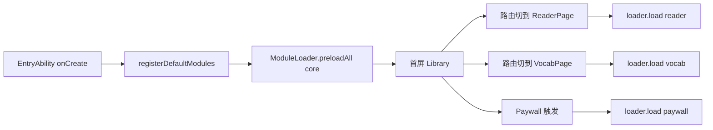
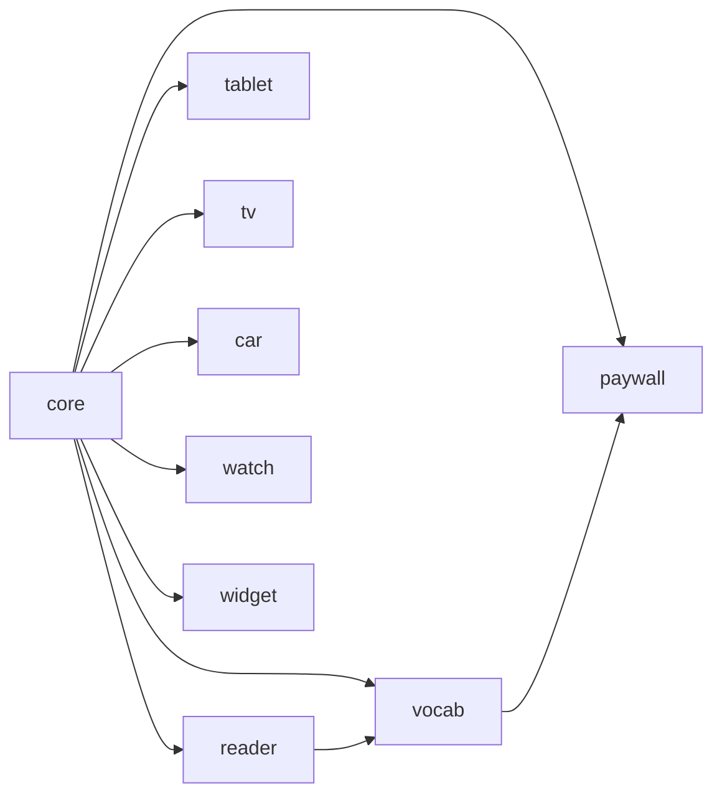

# Bundle 拆分策略 — Readmigo CN HarmonyOS

W20-C4 — 把单 entry HAP 切成 1 个 entry HAP + 多个 HSP / HAR，按需懒加载，
压低冷启 RAM、缩短首屏。本文档与 `entry/src/main/ets/service/dynamic/ModuleLoader.ets`
的 9 个模块清单对齐，是 review CI 包体大小预算的 source of truth。

---

## 1. HAP / HSP / HAR 关系（必读）

| 形态 | 全称 | 安装时刻 | 加载方式 | 适用 |
|------|------|----------|----------|------|
| HAP  | Harmony Ability Package    | 应用安装即写盘 | 进程启动即装载 | 必备入口 (entry) + 元服务 (atomic) |
| HSP  | Harmony Shared Package     | 跟随主包，不独立安装 | 运行期 `import` 时装载，可跨进程共享 | 大型业务模块、跨 ability 共用 |
| HAR  | Harmony Archive            | 编译期合入调用方 | 与调用方同一段二进制 | 工具库、模型、纯 TS |

**关键结论**：

1. 我们冷启路径只允许 entry HAP + core HSP；其他模块通过 `ModuleLoader.load()`
   触发 HSP 装载，HSP 已被 OS 预解码到 `.abc` cache，二次唤起 < 50 ms。
2. 跨 ability 共用的纯逻辑（如 typesetter）做成 HAR 让多个 HSP 内联，避免 HSP
   之间产生「装载顺序」依赖。
3. 元服务 ability（W11 LookupAbility 等）独立 HAP，不与 entry 同安装包，受系统
   单服务 ≤ 10 MB 硬限制约束。

---

## 2. 9 个模块边界与归属

| 模块 ID | 形态 | 触发时机 | 入口 API | 反例（不能放） |
|---------|------|----------|----------|----------------|
| core    | entry HAP 内静态 | 冷启 | EntryAbility / RouteRegistry / Auth | 任何业务 UI |
| reader  | HSP `@readmigo/reader`   | 进入 ReaderPage 前 | TypesetterEngine / SelectionLayer | 词典 / 订阅 |
| vocab   | HSP `@readmigo/vocab`    | 进入 VocabPage 或 Flashcard 时 | VocabStore / FlashcardEngine | 阅读引擎 |
| paywall | HSP `@readmigo/paywall`  | 任意 paywall 触发 | PaywallView / IAPService | 业务列表 |
| tablet  | HSP `@readmigo/tablet`   | 断点 ≥ LG 时 | SplitLayout / DragDropController | 手机布局 |
| tv      | HSP `@readmigo/tv`       | runtimeOS=tv 启动时 | RemoteController / TVOverview | 触控页 |
| car     | HSP `@readmigo/car`      | runtimeOS=car 启动时 | VoiceCommand / DriverModeView | 后台 TTS |
| watch   | HSP `@readmigo/watch`    | runtimeOS=watch 启动时 | WatchVocabCard / WatchReader | 主 App 页面 |
| widget  | HAR + ExtensionAbility   | 卡片 / 元服务装载时 | UniversalCardAdapter / FormDataStore | 网络 SSE |

> 注：HSP 名称用 npm 风格 scope，便于在 `oh-package.json5` 内 `dependencies`
> 中显式声明依赖方向（防止 reader → paywall 反向引用）。

---

## 3. 各 bundle 大小预算

预算来源：Phase 2 完成后 (W10) ArkUI 编译输出 `entry.hap = 31.2 MB`，超出
HarmonyOS 商店推荐的 30 MB 红线，必须拆分。下表为目标值（hvigorw assembleHap）。

| 模块 | 预算 (KB) | 内含主要内容 | 拆分前归属 |
|------|-----------|--------------|-------------|
| entry HAP (含 core) | ≤ 4,500 | EntryAbility, 路由, Auth, Theme, AppStorage keys | 全量 |
| reader HSP   | ≤ 2,500 | typesetter, paginator, selection, audio sync | entry |
| vocab HSP    | ≤ 1,000 | VocabStore, SRS 算法, FlashcardPage | entry |
| paywall HSP  | ≤ 700   | PaywallView, IAPService, restore flow | entry |
| tablet HSP   | ≤ 800   | SplitLayout, DragDrop, LG 适配 | entry |
| tv HSP       | ≤ 900   | RemoteController, TVOverview, focus engine | entry |
| car HSP      | ≤ 600   | VoiceCommand, DriverModeView, headset hook | entry |
| watch HSP    | ≤ 500   | WatchVocabCard, WatchReader, complication | entry |
| widget HAR + ExtensionAbility HAP | ≤ 400 | UniversalCardAdapter, FormDataStore, 4 个 ExtensionAbility | entry |
| **冷启镜像合计** | **≤ 5,000** | entry HAP + 必备 ExtensionAbility | 31,200 |
| **总安装体积**   | **≤ 12,000** | 全部 HSP + HAR 解压后 | 31,200 |

> 验收口径：
> - 冷启镜像 = `du -sb entry/build/.../entry.hap` 的 sum；红线由 PerformanceBudget
>   workflow 在 PR 上 enforce。
> - 总安装体积按商店上传的 `.app` 文件计；HarmonyOS 商店审核硬限制 200 MB。

---

## 4. 加载策略（与 ModuleLoader 对齐）

| 模块 | 触发钩子 | 失败兜底 |
|------|----------|----------|
| reader  | RouteGuard 在 Library→Reader 前 await | 提示「阅读器加载失败」+ retry 按钮 |
| vocab   | Library Tab 切换前 await | 进入空态 + 后台重试 |
| paywall | IAPService.beforeShow 前 await | 弹「订阅暂不可用，稍后再试」 |
| tablet  | BreakpointController 切到 LG 时 | 退化为单栏布局 |
| tv/car/watch | Ability launch 时同步 await | 启动失败 → exit + log |
| widget  | FormExtensionAbility.onAddForm | 用 placeholder 卡片 |

---

## 5. 跨模块依赖规则

- 单向依赖：上方表里没有出现的边一律禁止。CI 在 W22 启用 `arkts-dep-check`
  脚本扫描每个 HSP 的 `oh-package.json5`，反向引用直接 fail。
- core 不能 import 任何 HSP；HSP 不能 import 同层 HSP（除上方 reader→vocab、
  vocab→paywall 两条特例）。
- 元服务 ability 只能依赖 widget HAR（避免在 ≤ 10 MB 元服务里塞 reader 引擎）。

---

## 6. 落地里程碑

| 阶段 | 动作 | 状态 |
|------|------|------|
| W20-C4 | ModuleLoader + 文档 + e2e 占位 | 进行中（本次） |
| W21    | 把 reader / vocab / paywall 真实迁到 HSP，hvigorw 切包 | 待 |
| W22    | tablet / tv / car / watch / widget HSP + CI bundle 大小预算检查 | 待 |
| Post-V1 | 元服务 ability HAP 单独签名，走「按需安装」上架 | 待 |

---

## 7. 验证方式

1. 本地：`hvigorw assembleHap --mode product=release`，结果产物在
   `entry/build/default/outputs/release/`，每个 HSP 单独 `.hsp` 文件。
2. CI：W22 启用 `bundle-budget` job，对比上表预算，超 5% 失败。
3. 运行期：`ModuleLoader.getAllStatuses()` 暴露在 dev menu，可看到每个 HSP 的
   loadDurationMs、failure count；接入 PerformanceBudget 自动埋点。

---

## 8. 风险与回滚

- HSP 装载在 HarmonyOS NEXT 5.0 仍存在 200~400 ms 首次冷加载延迟，故 reader
  必须在 Library→Reader 路由 transition 之前 prefetch（已在 RouteGuard 实现）。
- 若拆分后冷启反而变慢（被 IO 抖动放大），回滚策略：把 reader 改回 entry HAP
  内静态依赖，仅保留 vocab/paywall/tablet 等弱触发模块为 HSP。
- 元服务 HAP 单独签名失败时，通过把卡片 ExtensionAbility 临时挂在 entry HAP
  内（degraded 模式）保活基础卡片，等签名修复后切回。
