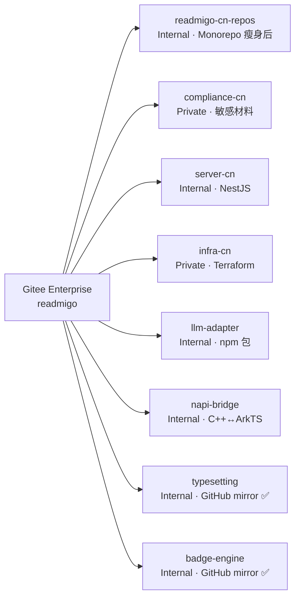

# Gitee 多 Repo 结构与迁移蓝图

## 2026-05-15 W25 进展（Phase A + mirror 收尾）

**Phase A — 消 monorepo `apps/` 包装层（完成）**
- `apps/harmony-app/` → `harmony-app/`（提升到 monorepo 根）
- 302 文件改动（270 rename + 32 path edits）
- Commit: `readmigo-cn-repos@157fc5c`
- 触发原因：apps/ 下只有 harmony-app 一个子目录，包装层无意义；同时为未来拆出 harmony-app 独立 repo 铺路（filter-repo 直接抽根目录而非 apps/ 子树）

**GitHub → Gitee mirror 收尾（完成）**
- 部署 `.github/workflows/mirror-to-gitee.yml` 到 `readmigo/typesetting` 和 `readmigo/badge-engine`
- 配 `GITEE_TOKEN` secret（Gitee PAT，scope=projects+enterprises）
- 首次手动 dispatch 成功；GitHub HEAD 与 Gitee HEAD 验证一致
- 此后每次 push GitHub main，30-60 秒自动同步到 Gitee

**W25 清理已完成（2026-05-16）**
- ✅ 删除 `sample_repository`（占位仓，已 404 验证）
- ✅ 5 个仓可见性 Private → Internal：server-cn / llm-adapter / napi-bridge / typesetting / badge-engine（用户报告，未走 API 二次验证）
- `infra-cn` 保留 Private（含华为云敏感配置）

## 2026-05-03 W24 拆分完成

W23 拆分完成 3 个独立仓:
- ✅ [server-cn](https://github.com/readmigo-cn/server-cn) (Private)
- ✅ [infra-cn](https://github.com/readmigo-cn/infra-cn) (Private)
- ✅ [llm-adapter](https://github.com/readmigo-cn/llm-adapter) (Private)

W24 拆分完成：
- ✅ [napi-bridge](https://github.com/readmigo-cn/napi-bridge) (Private)
- ✅ [typesetting](https://github.com/readmigo/typesetting) (Private)
- ✅ [badge-engine](https://github.com/readmigo/badge-engine) (Private)

详见拆分决策 [docs/architecture/01-repo-split-decision.md](architecture/01-repo-split-decision.md)
和 SOP [docs/architecture/02-server-cn-split-sop.md](architecture/02-server-cn-split-sop.md)。

---

本文档定义米果智读（Readmigo 国内本地化版）在 Gitee `readmigo` 企业（`gitee.com/readmigo`）下的多 repo 组织方式，参考 GitHub `readmigo` 组织的 28+ repo 模式。

## 现状（截至 W25）



| Repo | 可见性 | 内容 | 状态 |
|---|---|---|---|
| `readmigo/readmigo-cn-repos` | Internal | HarmonyOS App + compliance + docs + scripts + tools | 活跃开发 |
| `readmigo/server-cn` | Internal | NestJS 后端 | ✅ W23 拆出 + W25 Internal |
| `readmigo/infra-cn` | **Private** | Terraform（含华为云敏感配置） | ✅ W23 拆出 |
| `readmigo/llm-adapter` | Internal | LLM 适配 npm 包 | ✅ W23 拆出 + W25 Internal |
| `readmigo/napi-bridge` | Internal | C++↔ArkTS 桥 | ✅ W24 拆出 + W25 Internal |
| `readmigo/typesetting` | Internal | C++ 排版引擎（GitHub mirror） | ✅ W24 拆出 + W25 mirror + Internal |
| `readmigo/badge-engine` | Internal | C++ 勋章引擎（GitHub mirror） | ✅ W24 拆出 + W25 mirror + Internal |
| `readmigo/compliance-cn` | Private | 公司资质、身份证、软著 | 既有 |

## 后续规划（条件触发，不预设时间）

| Repo | 来源 | 状态 | 触发条件 |
|---|---|---|---|
| `harmony-app` | monorepo `harmony-app/` 子树 | 🗓 Phase 5 上架前 2-3 周（W18-W19） | 见下文「阶段 B 剧本」 |
| `docs-cn` | monorepo `docs/` 子树 | 🗓 条件触发 | 见下文「阶段 C 剧本」 |

---

## 阶段 B 剧本：拆 `harmony-app` 独立 repo

### 触发节点
**Phase 5 上架华为应用市场前 2-3 周**（路线图 W18-W19，从 Phase 0 启动算起约 4.5 个月后）。

### 为什么是这个节点（不更早不更晚）

| 节点 | 不行的理由 |
|---|---|
| 现在（W25） | app 仍在快速骨架阶段，独立 repo 增加切换成本 |
| Phase 1-3（W1-W16） | 客户端 + 鸿蒙特色还在频繁改，跨仓 PR 协调开销 > 收益 |
| Phase 4 末（W17） | 离上架仅 1 周，CI/签名/分支策略调试时间不够 |
| **W18-W19** | ✅ 客户端稳定 + 离上架 2-3 周缓冲，建 release pipeline 刚好 |
| Phase 5 末（W22） | 已上架，事后拆 = 在生产代码上做手术，风险高 |

### 前置条件 checklist（拆之前必须全 ✅）

- [ ] Phase 0 已启动（合规备案 + 团队 + 设备到位）
- [ ] Phase 1-3 基本走完（PoC + 核心 + 鸿蒙特色）
- [ ] harmony-app 代码 1 周内无 commits 量超过 50 LOC（稳定信号）
- [ ] 拿到华为应用市场签名证书（`.cer` / `.p7b` / debug + release）
- [ ] AGC 配置完成（`agconnect-services.json` 就位）
- [ ] 真机能跑通登录 → 阅读 → AI 解释 → IAP 下单 全流程

### 7 步执行（按序，每步 ✅ 才进下一步）

#### 步骤 1：预清理 monorepo
**目标**：harmony-app/ 内部不再依赖 monorepo 其他目录（除了 sibling 引用）。

```bash
cd /Users/HONGBGU/Documents/readmigo-cn/readmigo-cn-repos
grep -rE '"\.\./(scripts|docs|tools)/' harmony-app/ --include="*.ts" --include="*.ets" --include="*.json5"
# 期望：无输出。如有，要么把被引用的东西复制进 harmony-app/，要么改走绝对路径
```

CMakeLists 中的 `${REPO_ROOT}/../napi-bridge`、`${REPO_ROOT}/../typesetting`、`${REPO_ROOT}/../badge-engine` 是 sibling 引用（指向兄弟 repo），拆分后仍可工作 —— **不要动**。

#### 步骤 2：抽出 harmony-app 历史
```bash
cd /tmp
git clone git@github.com:readmigo-cn/readmigo-cn-repos.git extract-harmony-app
cd extract-harmony-app
git filter-repo --subdirectory-filter harmony-app
# 这会把 harmony-app/ 提升到根，丢弃其他目录的所有 commits
git log --oneline | wc -l  # 期望：~80% 原 commits（涉及 harmony-app 的部分）
du -sh .git/  # 期望：< 50 MB
```

#### 步骤 3：建 Gitee repo
```bash
curl -X POST https://gitee.com/api/v5/enterprises/readmigo/repos \
  -H "Content-Type: application/json" \
  -d '{
    "access_token": "'"$GITEE_PAT"'",
    "name": "harmony-app",
    "description": "米果智读 HarmonyOS NEXT 客户端",
    "private": true
  }'
```
默认 Private；事后 web UI 改 Internal。

#### 步骤 4：推上去 + 配 CI
```bash
cd /tmp/extract-harmony-app
git remote add origin git@github.com:readmigo/harmony-app.git
git push -u origin main
```

在新 repo 加 `.gitee/workflows/`：
- `build-hap.yml`：每次 PR 跑 ohpm install + hvigorw assembleHap --mode debug
- `test.yml`：跑 ohosTest
- `release.yml`：tag 触发，跑 hvigorw assembleHap --mode release --sign + 输出 .hap

签名证书走 Gitee Secrets：`HARMONY_RELEASE_KEYSTORE_B64` / `HARMONY_RELEASE_KEYSTORE_PWD`。

#### 步骤 5：分支策略
| 分支 | 用途 | 保护 |
|---|---|---|
| `main` | 已上架版本 | force-push 禁，必须 PR + 1 reviewer + CI 绿 |
| `develop` | 日常合并 | 半保护，允许 force-push（紧急用） |
| `release/v1.0.x` | 上架审核分支 | 创建后 freeze 到上架完成 |
| `hotfix/*` | 紧急修复 | 从 main 切，合回 main + develop |

CODEOWNERS：所有 ets/cpp 改动需 `@${TL}` review。

#### 步骤 6：monorepo 端收尾
```bash
cd /Users/HONGBGU/Documents/readmigo-cn/readmigo-cn-repos
git rm -r harmony-app/
# 改 pnpm-workspace.yaml: 删除 "harmony-app"
# 改 README / PROJECT.md / docs/ 中所有指向 harmony-app/ 的路径 → 改成 github.com/readmigo/harmony-app URL
# 改根 .gitignore：删除 harmony-app/* 相关条目
git commit -m "refactor(repo): 拆出 harmony-app 独立仓"
```

#### 步骤 7：真机验证
- 把 `/Users/HONGBGU/Documents/readmigo-cn/harmony-app/` clone 下来
- DevEco Studio 打开 → 真机跑通登录 / 阅读 / Native（typesetting + badge-engine）链路
- 验证 sibling 引用：`${REPO_ROOT}/../napi-bridge` 在新位置仍能解析（harmony-app 和 napi-bridge 现在是同级目录）
- HAP 签名 + 上架前预审通过

### 何时**驳回**拆分（信号）
- Phase 0 推迟 / 团队仍是单人 → 取消拆分，留 monorepo
- 鸿蒙 NEXT 发生破坏性升级（如 API 13 重写 ArkTS） → 等重写完
- 上架审核被驳 3 次以上 → 先解决审核问题再拆

---

## 阶段 C 剧本：拆 `docs-cn`（建独立文档站）

### 触发条件（满足其一才执行）

| 条件 | W25 当前值 | 阈值 |
|---|---|---|
| docs/ 体量 | 588 KB / 41 文件 / 15,555 行 | > 5 MB **或** > 200 文件 |
| 多人编辑 | 单人 | docs 改动节奏与代码改动冲突 |
| 战略需求 | 无 | 决定建 `docs.readmigo.cn`（对齐海外 docs.readmigo.app） |

### 触发后 6 步

#### 步骤 1：选 SSG
**默认对齐海外 docs.readmigo.app 的 SSG**（查 readmigo-repos/docs/ 用啥）。
- 如果海外用 Hugo → 国内也用 Hugo（团队学习成本 0）
- 备选：VitePress（前端栈一致）、Nextra（Next.js 已在 web 仓用）

#### 步骤 2：抽出 docs/
```bash
cd /tmp
git clone git@github.com:readmigo-cn/readmigo-cn-repos.git extract-docs
cd extract-docs
git filter-repo --subdirectory-filter docs
```

**注意保留**：`docs/architecture/templates/`（mirror workflow 模板还要用），考虑是否移到 readmigo-cn-repos 根的 `templates/`。

#### 步骤 3：建 Gitee repo + 推
```bash
curl -X POST https://gitee.com/api/v5/enterprises/readmigo/repos \
  -d '{"access_token":"'"$GITEE_PAT"'","name":"docs-cn","private":false}'
# 文档对企业内部开放 → Internal（web UI 改）

cd /tmp/extract-docs
git remote add origin git@github.com:readmigo/docs-cn.git
git push -u origin main
```

#### 步骤 4：域名 + ICP 备案
- `docs.readmigo.cn` 二级域名
- 走"接入备案"（主站 `readmigo.cn` 已备：冀ICP备2026009459号）
- 配 SSL 证书（华为云 SCM 免费 DV）
- DNS 解析到华为云 OBS / CDN

#### 步骤 5：CI 自动部署
不能用 GitHub Pages（域名 ICP 备问题）→ 走华为云 OBS 静态托管：
- `.gitee/workflows/deploy-docs.yml`
- push main → SSG build → 上传 OBS bucket
- OBS bucket 绑定 docs.readmigo.cn 域名

#### 步骤 6：monorepo 收尾
- 删 monorepo 的 `docs/`
- 改 README.md / PROJECT.md 顶部添加 "📚 文档站：https://docs.readmigo.cn"
- 把架构/部署 SOP 等内部专用文档**保留在 monorepo**，新仓只放对外可读文档

### 拆 docs 的反方意见

**强烈考虑不拆**：
- 国内合规文档站初始配置成本 = 3-5 工作日（OBS + CDN + WAF + ICP 接入备）
- docs 体量小（588 KB）+ 单人维护，拆出来反而要在 monorepo ↔ docs 仓之间切换
- 替代方案：对外公开的部分（介绍/隐私政策/用户协议）放到 readmigo.cn 主站 H5，内部文档继续留 monorepo

**只有当海外 docs 站已成熟 + 国内团队 ≥ 3 人时，拆 docs 才有正收益**。

---

## 可见性规则

| 内容类型 | 可见性 | 理由 |
|---|---|---|
| 公司资质、身份证、软著等敏感材料 | **Private** | 个人/企业证件不可外泄 |
| 部署凭证、AccessKey、密钥（永远 gitignore） | 不入库 | 走凭证管理系统 |
| 基础设施配置（Terraform、Nginx、k8s） | **Private** | 含服务 IP、域名 SSL、资源 ID |
| 业务代码、文档、政策模板 | Internal | 企业成员可见 |
| 开源参考、品牌物料 | Public | 可公开 |

> **W25 现状校准（已落地）**：5 个业务代码仓（server-cn / llm-adapter / napi-bridge / typesetting / badge-engine）通过 Gitee web UI 改为 Internal（2026-05-16）。`infra-cn` 保留 Private（含华为云敏感配置）。Gitee Enterprise API 不支持设 Internal，必须 web UI 手动操作。

## Gitee Enterprise 概念对照 GitHub Org

| GitHub | Gitee | 说明 |
|---|---|---|
| Org（`github.com/readmigo`） | Enterprise（`gitee.com/readmigo`） | 顶层 namespace |
| Team | Members + Roles（admin / member） | Gitee 用 web UI 管理"部门"，无开放 API |
| Repo（Public / Private） | Repo（Public / Internal / Private） | Gitee 多一档 Internal |
| 多 repo 命名 `<org>/<repo>` | 多 repo 命名 `<enterprise>/<repo>` | 两边都是平铺 |

## 命名约定

- **国内专属**：后缀 `-cn`（如 `compliance-cn` `server-cn` `infra-cn` `docs-cn`）
- **跨地域共享**：无后缀（如 `typesetting` `badge-engine`，与 GitHub 同名 repo 镜像同步）
- **平台专属**：以平台命名（如 `harmony-app`）

## 与 GitHub 海外侧的关系

- **GitHub `readmigo/harmony`**：原本承担 Readmigo 海外版进入中国 App Store 的合规工作，已与本仓 compliance/ 体系合并。**计划删除**（敏感材料已迁至 `github.com/readmigo/compliance-cn`，公开材料归入本 monorepo `compliance/`）
- **GitHub `readmigo/typesetting` `readmigo/badge-engine`**：海外侧的 C++ 引擎主仓。国内通过 mirror workflow 自动同步（W25 已就位，见顶部 W25 进展）

## 维护流程

1. **新建 Gitee repo**：通过 Gitee Enterprise web UI 或 API（`POST /api/v5/enterprises/readmigo/repos`）
2. **可见性设置**：创建时用 `public=false` 参数；Internal 必须 web UI 手动改
3. **本地 SSH alias**：用 `~/.ssh/config` 中的 `github.com` (default host) host alias 走专属密钥
4. **多 repo 拆分时**：用 `git filter-repo` 拆出子目录历史；不要简单 cp（会丢 git 历史）
5. **跨仓引用**：通过 `${REPO_ROOT}/../<sibling-repo>` 相对路径，要求所有 sibling repo 位于同一父目录（如 `/Users/HONGBGU/Documents/readmigo-cn/`）
