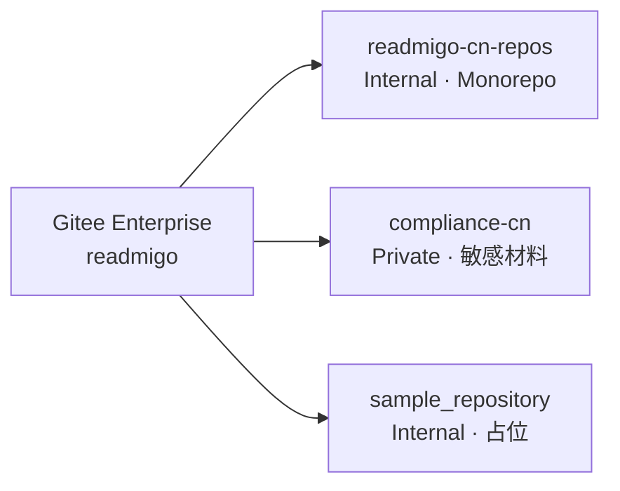
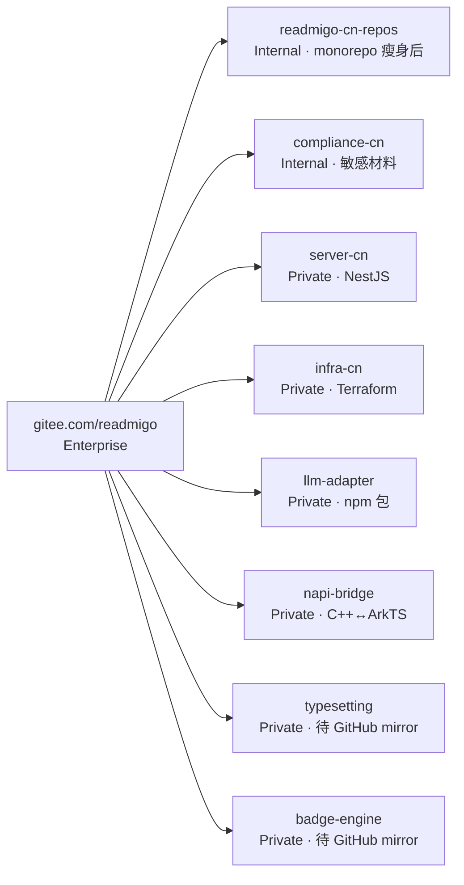

# Gitee 多 Repo 结构与迁移蓝图

## 2026-05-03 W24 拆分完成（同日内推进）

W23 拆分完成 3 个独立仓:
- ✅ [server-cn](https://gitee.com/readmigo/server-cn) (Private)
- ✅ [infra-cn](https://gitee.com/readmigo/infra-cn) (Private)
- ✅ [llm-adapter](https://gitee.com/readmigo/llm-adapter) (Private)

W24 拆分完成：
- ✅ [napi-bridge](https://gitee.com/readmigo/napi-bridge) (Private)
- ✅ [typesetting](https://gitee.com/readmigo/typesetting) (Private, 待 GitHub mirror)
- ✅ [badge-engine](https://gitee.com/readmigo/badge-engine) (Private, 待 GitHub mirror)

详见拆分决策 [docs/architecture/01-repo-split-decision.md](architecture/01-repo-split-decision.md)
和 SOP [docs/architecture/02-server-cn-split-sop.md](architecture/02-server-cn-split-sop.md)。

---

本文档定义米果智读（Readmigo 国内本地化版）在 Gitee `readmigo` 企业（`gitee.com/readmigo`）下的多 repo 组织方式，参考 GitHub `readmigo` 组织的 28+ repo 模式。

## 现状

| Repo | 可见性 | 内容 | 状态 |
|---|---|---|---|
| `readmigo/readmigo-cn-repos` | Internal | HarmonyOS App + server-cn + native + napi-bridge + llm-adapter + docs（pnpm monorepo） | 活跃开发 |
| `readmigo/compliance-cn` | **Private** | 公司营业执照、法人/个人身份证、软著申请材料 | 本次新建，承接 GitHub `readmigo/harmony` 历史敏感材料 |
| `readmigo/sample_repository` | Internal | Gitee 占位 | 可清理 |

## 拆分进度（W23-W24 已完成）

参考 GitHub `readmigo` 组织的拆分模式，按职责切分：

| Repo | 来源 | 可见性 | 状态 | 拆分时机 |
|---|---|---|---|---|
| `server-cn` | `server-cn/` | Internal | **✅ W23 完成** | 阶段 1（独立部署需要） |
| `infra-cn` | `infra/` | **Private** | **✅ W23 完成** | 阶段 1（含华为云敏感配置） |
| `llm-adapter` | `packages/llm-adapter/` | Internal | **✅ W23 完成** | 阶段 2（被多个项目引用时） |
| `napi-bridge` | `napi-bridge/` | **Private** | **✅ W24 完成** | 仅当独立发布时 |
| `typesetting` | 镜像 GitHub `readmigo/typesetting` | **Private** | **✅ W24 完成（待 GitHub mirror）** | 国内 dev 链路需要 |
| `badge-engine` | 镜像 GitHub `readmigo/badge-engine` | **Private** | **✅ W24 完成（待 GitHub mirror）** | 后续 |
| `harmony-app` | `harmony-app/` + 紧耦合的 `napi-bridge/` `native/` | Internal | ⚪ 规划中 | apps 体量超过阈值 |
| `docs-cn` | `docs/`（本目录） | Internal | ⚪ 规划中 | 独立发布站点时 |

## 可见性规则

| 内容类型 | 可见性 | 理由 |
|---|---|---|
| 公司资质、身份证、软著等敏感材料 | **Private** | 个人/企业证件不可外泄 |
| 部署凭证、AccessKey、密钥（永远 gitignore） | 不入库 | 走凭证管理系统 |
| 基础设施配置（Terraform、Nginx、k8s） | **Private** | 含服务 IP、域名 SSL、资源 ID |
| 业务代码、文档、政策模板 | Internal | 企业成员可见 |
| 开源参考、品牌物料 | Public | 可公开 |

> **现状校准（2026-05-03）**：基础设施 + 业务代码仓 (`server-cn`/`infra-cn`/`llm-adapter`/`napi-bridge`/`typesetting`/`badge-engine`) 当前 Gitee API 创建后均为 **Private**。Gitee Enterprise API 不支持设 Internal，需 web UI 手动改。docs 此前标的 Internal 是规划目标，未与实际状态对齐 → 本次校准后表示真实状态。

## Gitee Enterprise 概念对照 GitHub Org

| GitHub | Gitee | 说明 |
|---|---|---|
| Org（`github.com/readmigo`） | Enterprise（`gitee.com/readmigo`） | 顶层 namespace |
| Team | Members + Roles（admin / member） | Gitee 用 web UI 管理"部门"，无开放 API |
| Repo（Public / Private） | Repo（Public / Internal / Private） | Gitee 多一档 Internal |
| 多 repo 命名 `<org>/<repo>` | 多 repo 命名 `<enterprise>/<repo>` | 两边都是平铺 |

## 命名约定

- **国内专属**：后缀 `-cn`（如 `compliance-cn` `server-cn` `infra-cn` `llm-adapter-cn`）
- **跨地域共享**：无后缀（如 `typesetting` `badge-engine`，与 GitHub 同名 repo 镜像同步）
- **平台专属**：以平台命名（如 `harmony-app`）

## 与 GitHub 海外侧的关系

- **GitHub `readmigo/harmony`**：原本承担 Readmigo 海外版进入中国 App Store 的合规工作，已与本仓 compliance/ 体系合并。**计划删除**（敏感材料已迁至 `gitee.com/readmigo/compliance-cn`，公开材料归入本 monorepo `compliance/`）
- **GitHub `readmigo/typesetting` `readmigo/badge-engine`**：海外侧的 C++ 引擎主仓。国内若需要独立 dev 链路，可建 Gitee 镜像（用 mirror 同步而非分叉）

## 维护流程

1. **新建 Gitee repo**：通过 Gitee Enterprise web UI 或 API（`POST /api/v5/enterprises/readmigo/repos`）
2. **可见性设置**：创建时用 `public=false` 参数；Private 需另设
3. **本地 SSH alias**：用 `~/.ssh/config` 中的 `gitee-readmigo-cn` host alias 走专属密钥
4. **多 repo 拆分时**：用 `git filter-repo` 拆出子目录历史；不要简单 cp（会丢 git 历史）
