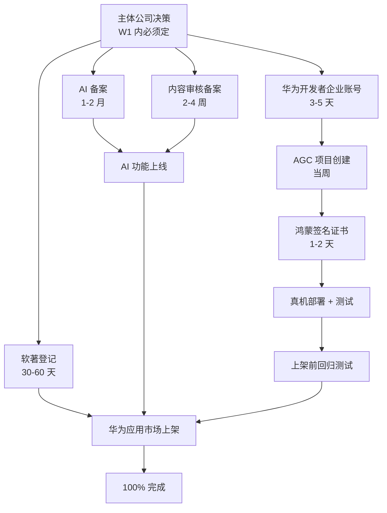

# 22 周执行编排计划

> **创建时间**：2026-05-01
> **W23 拆分后状态**（2026-05-03）：server-cn / infra-cn / llm-adapter 已迁出为独立 Gitee 仓。详见 [docs/architecture/01-repo-split-decision.md](architecture/01-repo-split-decision.md)
> **覆盖范围**：米果智读（Readmigo 国内本地化版）从 Phase 0 到 Phase 5，22 周完整路线图
> **执行模式**：单 Claude 会话推进 1 周里程碑 / 22 次会话走完
> **本文档地位**：单一真相（single source of truth）。所有任务必须可在此追踪。
> **配套文件**：
> - [05-roadmap.md](./05-roadmap.md) — 原始路线图（22 周高层视角）
> - [15-feature-parity-checklist.md](./15-feature-parity-checklist.md) — 176 功能对齐
> - [40-gitee-repo-structure.md](./40-gitee-repo-structure.md) — Gitee 多 repo 蓝图
> - [compliance/STATUS.md](../compliance/STATUS.md) — 合规进度

---

## 目录

1. [总览](#1-总览)
2. [角色边界（CODE / PREP / EXTERNAL）](#2-角色边界)
3. [关键路径与依赖图](#3-关键路径与依赖图)
4. [主体公司决策（W1 必决）](#4-主体公司决策w1-必决)
5. [风险登记册](#5-风险登记册)
6. [Subagent 编排策略](#6-subagent-编排策略)
7. [Week-by-Week 详细计划](#7-week-by-week-详细计划)
   - [Phase 0 / Phase 1 (W1-W4)](#phase-0--phase-1-w1-w4)
   - [Phase 2 (W5-W10)](#phase-2-w5-w10)
   - [Phase 3 (W11-W16)](#phase-3-w11-w16)
   - [Phase 4 (W17-W19)](#phase-4-w17-w19)
   - [Phase 5 (W20-W22)](#phase-5-w20-w22)
8. [验收 / Review 节奏](#8-验收--review-节奏)
9. [应急预案](#9-应急预案)
10. [完工定义（DoD）](#10-完工定义-dod)

---

## 1. 总览

### 1.1 目标

**100% 完成 = 满足以下 5 个 Definition of Done（DoD）：**

| # | DoD 项 | 验收标准 |
|---|---|---|
| 1 | 176 功能项全部实现 | [15-feature-parity-checklist.md](./15-feature-parity-checklist.md) 18 类全部 ✅ |
| 2 | 合规备案全部通过 | ICP / 软著 / AI / 内容审核 / 算法 / 等保（如需）全部 🟢 |
| 3 | 应用上架通过 | 华为 AppGallery + iOS App Store CN 通过审核 |
| 4 | 内容池可用 | ≥ 1000 本经审核图书 + ≥ 100 本带 TTS 的有声书 |
| 5 | 上线后 7 天稳定运行 | 崩溃率 < 0.1% / API 可用性 > 99.5% / 关键功能 P0 故障 = 0 |

### 1.2 时间线甘特图

```
                    W1   W2   W3   W4   W5   W6   W7   W8   W9   W10  W11  W12  W13  W14  W15  W16  W17  W18  W19  W20  W21  W22
Phase 0 合规        ▓▓▓▓▓▓▓▓▓▓▓▓▓▓▓▓                                                                                            （持续推进至 W22）
Phase 1 PoC         ▓▓▓▓▓▓▓▓▓▓▓▓▓▓▓▓
Phase 2 客户端核心                      ▓▓▓▓▓▓▓▓▓▓▓▓▓▓▓▓▓▓▓▓▓▓▓▓
Phase 3 鸿蒙特色                                                  ▓▓▓▓▓▓▓▓▓▓▓▓▓▓▓▓▓▓▓▓▓▓▓▓
Phase 4 HMS 商业化                                                                            ▓▓▓▓▓▓▓▓▓▓▓▓
Phase 5 上架                                                                                              ▓▓▓▓▓▓▓▓▓▓▓▓
持续合规           ▓▓▓▓▓▓▓▓▓▓▓▓▓▓▓▓▓▓▓▓▓▓▓▓▓▓▓▓▓▓▓▓▓▓▓▓▓▓▓▓▓▓▓▓▓▓▓▓▓▓▓▓▓▓▓▓▓▓▓▓▓▓▓▓▓▓▓▓▓▓▓▓▓▓▓▓▓▓▓▓▓▓▓▓▓▓▓▓▓▓▓▓▓▓▓▓▓▓▓▓▓▓▓▓
内容池采购         ▓▓▓▓▓▓▓▓▓▓▓▓▓▓▓▓▓▓▓▓▓▓▓▓▓▓▓▓▓▓▓▓▓▓▓▓▓▓▓▓▓▓▓▓▓▓▓▓▓▓▓▓▓▓▓▓▓▓▓▓▓▓▓▓▓▓▓▓▓▓▓▓▓▓▓▓▓▓▓▓▓▓▓▓▓▓▓▓▓▓▓▓▓▓▓▓▓▓▓▓▓▓▓▓
```

### 1.3 角色

| 角色 | 职责 |
|---|---|
| 你（Founder） | 决策 / 备案 / 招聘 / 采购 / 资金 / 合规审批 |
| Claude（CODE 主力） | 写代码 / 写文档 / 起草材料 / 编排 subagent |
| Subagents（Claude 派遣） | 并行执行各模块代码 / 测试 / 集成 |
| 华为 / 各 LLM 提供商 | API key / 商品配置 / 真机 / 备案审批 |

---

## 2. 角色边界

每个任务标注 **🟢 / 🟡 / 🟠 / 🔴**：

| 标记 | 含义 | 示例 |
|---|---|---|
| 🟢 **CODE 纯代码** | Claude 直接做，可在会话内交付 | ArkTS 页面、server-cn 模块、单元测试、Mermaid 图 |
| 🟡 **CODE + 凭证** | 写完整代码 + Mock；凭证到位时切换 | LLM API client 接 Mock，等 API key 切真实 |
| 🟠 **CODE + 真机** | 写代码；模拟器测；真机你来回归 | NAPI 桥、TTS 朗读、HMS Push 通知 |
| 🔴 **EXTERNAL** | 起草材料 + SOP；执行你来 | ICP 备案提交、招聘、设备采购、版权谈判 |

每个 weekly milestone 都按这 4 类拆分。

---

## 3. 关键路径与依赖图

### 3.1 主依赖链



### 3.2 关键路径

**最长链** = 主体公司决策（W1） → AI 备案审批（W1+ 1-2 月，至少到 W6-W10） → AI 功能上线（W11+） → 上架（W22）

⚠️ **任何 W1 内未启动的 EXTERNAL 都会推迟终点。**

### 3.3 可并行链

- 客户端 ArkTS 开发（W1-W22 持续）
- Server-cn 后端开发（W3-W22 持续）
- 内容池采购（W1-W22 持续）
- C++ 引擎共享（W2-W4 完成后稳定）
- 设计系统 / 通用组件（W5-W6 完成后稳定）

---

## 4. 主体公司决策（W1 必决）

### 4.1 选项对比

| 维度 | A. 新设公司（推荐） | B. 沿用现有公司 |
|---|---|---|
| 法人 | 独立 | 共用 |
| 数据隔离 | 干净 | 混合 |
| 备案干净 | ✅ | ❌（主营业务可能不符） |
| 注册周期 | 2-4 周 | 立即可用 |
| 注册资本 | 1-10 万 | 无新增 |
| 年报成本 | 新增 | 无新增 |
| 适用 | 长期独立运营 | 短期试探 |

### 4.2 推荐：A. 新设公司

理由：
- 海外版的 readmigo.app 业务可能与国内"AI 教育"备案要求不一致
- 独立主体便于将来融资 / 估值 / 合规审计
- 数据隔离对个保法合规有利

### 4.3 W1 决策清单

- [ ] 决定 A / B
- [ ] 选择公司名称（候选 3 个，进行核名）
- [ ] 选择注册地（推荐：北京海淀 / 朝阳 / 通州，享教育产业政策）
- [ ] 注册资本（建议 1-10 万）
- [ ] 经营范围模板（包含「软件开发、人工智能应用软件开发、信息技术咨询、数据处理服务、互联网信息服务」）
- [ ] 法人 / 监事 / 财务

> **若选 B**：在 W1 内确认现有公司经营范围是否覆盖。

---

## 5. 风险登记册

| ID | 风险 | 概率 | 影响 | 等级 | 缓解措施 |
|---|---|---|---|---|---|
| R1 | AI 备案审批延期或拒绝 | 中 | 阻塞 | 🔴 极高 | W1 立即提交；准备多轮补正；同步准备「无 AI 版本」降级方案 |
| R2 | 内容版权谈判失败 | 中 | 阻塞 | 🔴 极高 | W1 启动；多方并行（Standard Ebooks 中文 / 国内公版 / 教材出版社）；准备「自有原创内容」备选 |
| R3 | 华为开发者审核拒绝 | 低 | 中等 | 🟡 中 | 主体决策时选择经营范围合规的公司；申请前自查 |
| R4 | HMS IAP 商品审核拒绝 | 中 | 中等 | 🟡 中 | 提前 W14 在 AGC 后台配置；按华为商品分类规范命名 |
| R5 | 鸿蒙真机调试瓶颈 | 中 | 局部 | 🟡 中 | 设备采购涵盖手机/平板/折叠屏 3 类；建立一键 deploy 脚本 |
| R6 | 国产 LLM 服务不稳定 | 中 | 局部 | 🟡 中 | llm-adapter 已支持 4 provider，自动 failover |
| R7 | 团队招募失败（仅 founder solo） | 高 | 速度 | 🟡 中 | 接受单人节奏；优先用 Claude + subagent 替代部分人力 |
| R8 | 网信办审核拒绝（内容池/AI） | 低 | 阻塞 | 🟠 高 | 政策模板已起草；提前自审内容池 |
| R9 | 数据合规要求变化（个保法/数据出境） | 低 | 中等 | 🟡 中 | server-cn 严格"数据不出境"架构；用华为云 |
| R10 | 应用上架被拒 | 低 | 延期 | 🟡 中 | 提前 W18 完成内部审核；自查华为审核细则 |

---

## 6. Subagent 编排策略

### 6.1 编排原则

- **每周派遣 4-8 个 subagent 并行**，主 agent 编排 + 集成 + 提交
- 每个 subagent 任务必须**完全独立**（无共享状态、无依赖顺序），否则改为主 agent 串行
- Subagent 不能 commit / push（避免冲突），统一交主 agent 提交

### 6.2 编排模式（按周）

| 周 | 推荐 subagent 数 | 编排模式 |
|---|---|---|
| W1 | 6 | 4 PREP 文档（主体决策/AI备案/内容审核/招聘JD）+ 2 CODE（CI/IaC） |
| W2 | 4 | 4 CODE：NAPI 桥框架 / typesetting bridge（独立仓 [`typesetting`](https://github.com/readmigo/typesetting)） / badge-engine bridge（独立仓 [`badge-engine`](https://github.com/readmigo/badge-engine)） / XComponent demo |
| W3 | 8 | 8 CODE：server-cn 拷贝 8 个模块（auth/books/reading/notes/ai/subscription/widget/sync） |
| W4 | 5 | 5 CODE：HMS Account Mock / Login UX / 书库列表 / Reader 翻页 / e2e 联调 |
| W5-W6 | 6 | UIAbility / 设计系统 / 暗色模式 / 通用组件库 / Token 映射 / 字体策略 |
| W7-W8 | 7 | 阅读器排版 / TTS / AI 划词 / 笔记 / 词卡 SRS / 进度同步 / 离线缓存 |
| W9-W10 | 6 | RDB 封装 / Preferences / LLM adapter ArkTS 重写 / OBS / 集成测试 / 文档 |
| W11-W12 | 6 | 元服务 4 个 / 服务卡片 3 个 / 万能卡片 |
| W13-W14 | 5 | 分布式 Ability / 多端协同 / 数据迁移 / 跨端剪贴板 / NFC |
| W15-W16 | 5 | 折叠屏 / 平板 / 手表 / 智慧屏 / 车机 layout 适配 |
| W17 | 6 | HMS IAP / 微信 / 支付宝 / 订阅状态 / Paywall / 退款流程 |
| W18 | 5 | HMS Push / 神策埋点 / AGC Crash / Sentry / 通知中心 |
| W19 | 5 | 客服 / 反馈 / FAQ / 关于页 / 隐私页 |
| W20 | 4 | 应用截图 / 商店描述 / 性能优化 / 内部测试 |
| W21 | — | 提交审核（EXTERNAL，无 subagent） |
| W22 | 3 | 上线监控 / 紧急修复 / 用户反馈处理 |

### 6.3 Agent 类型选择

| 任务类型 | subagent_type |
|---|---|
| 一般 ArkTS / TypeScript 实现 | `general-purpose` |
| 代码 review | `code-reviewer-pro` |
| 性能优化 | `performance-engineer` |
| 安全审计 | `security-auditor` |
| 测试 | `test-engineer` / `test-automator` |
| 文档 | `documentation-expert` |
| 数据库 | `database-optimizer` |
| 后端架构 | `backend-architect` |
| 部署 | `deployment-engineer` |
| 调试 | `debugger` |

---

## 7. Week-by-Week 详细计划

### Phase 0 / Phase 1 (W1-W4)

#### **W1：合规启动 + CI/IaC 骨架** ⭐ 最关键

**目标**：所有 EXTERNAL 关键路径启动；基础工程化设施就位。

##### 🟢 CODE 任务（Claude）

| ID | 任务 | 文件 | 估算 LOC |
|---|---|---|---|
| W1-C1 | Gitee Actions CI 模板（PR / build / typecheck / lint） | `.gitee/workflows/ci.yml` | 80 |
| W1-C2 | Gitee Actions 构建产物上传（HAP / Server image） | `.gitee/workflows/build.yml` | 100 |
| W1-C3 | DevEco 项目骨架完善（hvigor / oh-package 修订） | `harmony-app/{build-profile,oh-package}.json5` | 30 |
| W1-C4 | server-cn Dockerfile + docker-compose 完整化 | `server-cn/{Dockerfile,docker-compose.yml}` ([gitee](https://github.com/readmigo-cn/server-cn/blob/main/)) | 80 |
| W1-C5 | 极狐 GitLab CE IaC（docker-compose / Helm） | `infra-cn/gitlab-ce/docker-compose.yml` ([gitee](https://github.com/readmigo-cn/infra-cn/blob/main/)) + README | 200 |
| W1-C6 | 测试框架接入（jest 给 server-cn / hypium 给 ArkTS） | 各项目 test config | 120 |

##### 🟡 PREP 任务（Claude 起草）

| ID | 产出物 | 路径 | 估算字数 |
|---|---|---|---|
| W1-P1 | 主体公司决策文档（A vs B 详细对比） | `compliance/company-formation/00-decision.md` | 3000 |
| W1-P2 | AI 备案完整申请材料 | `compliance/ai-service-filing/02-application-final.md` + 算法机制机理审核情况 PDF 模板 | 8000 |
| W1-P3 | 内容审核备案完整申请材料 | `compliance/content-moderation/00-application.md` | 5000 |
| W1-P4 | 算法备案申请材料（与 AI 合并） | `compliance/algorithm-filing/00-application.md` | 4000 |
| W1-P5 | 招聘 JD（鸿蒙工程师 / 后端 / 设计） | `docs/team/jd-{harmonyos-engineer,backend,designer}.md` | 6000 |
| W1-P6 | 设备采购清单（手机/平板/折叠屏） | `docs/devices/procurement-list.md` | 2000 |
| W1-P7 | 用户协议定稿 | `compliance/policies/user-agreement.md` | 6000 |
| W1-P8 | 未成年人保护协议 | `compliance/policies/minor-protection.md` | 3000 |
| W1-P9 | 内容池采购清单 + 版权方对接 SOP | `docs/content/00-acquisition-strategy.md` | 4000 |

##### 🔴 EXTERNAL 任务（你做）

| ID | 任务 | 截止 |
|---|---|---|
| W1-E1 | 主体公司决策 → 启动注册（如新设） | **W1 周末** |
| W1-E2 | 提交 AI 备案到国家网信办 | **W1 周末** |
| W1-E3 | 提交内容审核备案 | W1 周末 |
| W1-E4 | 注册华为开发者企业账号 | W1 周末 |
| W1-E5 | 启动内容版权谈判（Standard Ebooks 中文 / 国内公版 / 出版社） | W1 周末 |
| W1-E6 | 跟进 ICP 备案 / 软著实名审核 | 持续 |

##### 验收标准

- [ ] CI 在 readmigo-cn-repos / compliance-cn 跑通
- [ ] 9 份 PREP 文档全部入库
- [ ] 6 个 EXTERNAL 任务有明确进度（提交编号 / 申请回执）

---

#### **W2：C++ NAPI 桥接框架完整化**

**目标**：独立仓 [`typesetting`](https://github.com/readmigo/typesetting) + [`badge-engine`](https://github.com/readmigo/badge-engine) 双 native 桥接跑通，HAP 真机部署。

##### 🟢 CODE 任务

| ID | 任务 | 文件 | LOC |
|---|---|---|---|
| W2-C1 | NAPI 桥接框架（统一错误处理、类型转换） | `napi-bridge/src/common/{error,convert}.cpp` | 400 |
| W2-C2 | typesetting NAPI 完整接口（doc/page/render/measure） | `napi-bridge/src/typesetting_napi.cpp` | 600 |
| W2-C3 | badge-engine NAPI 接口（init/eval/render） | `napi-bridge/src/badge_engine_napi.cpp` | 500 |
| W2-C4 | CMake + arm64-v8a NDK 配置 | `harmony-app/entry/src/main/cpp/CMakeLists.txt` | 80 |
| W2-C5 | XComponent 集成示例（带交互） | `harmony-app/entry/src/main/ets/native/XComponentDemo.ets` | 200 |
| W2-C6 | typesetting.so / badge_engine.so 编译脚本 | `scripts/build-native.sh` + CI 集成 | 100 |
| W2-C7 | ArkTS 端 typesetting 完整 binding | `harmony-app/entry/src/main/ets/native/typesetting.ets` | 250 |
| W2-C8 | ArkTS 端 badge-engine binding | `harmony-app/entry/src/main/ets/native/badge-engine.ets` | 200 |

##### 🟡 PREP 任务

| ID | 产出物 | 路径 |
|---|---|---|
| W2-P1 | 鸿蒙签名证书申请 SOP | `docs/deployment/01-harmonyos-signing.md` |
| W2-P2 | DevEco 真机部署 SOP | `docs/deployment/02-real-device-deploy.md` |
| W2-P3 | C++ 引擎升级流程文档（同步独立仓 [`typesetting`](https://github.com/readmigo/typesetting) / [`badge-engine`](https://github.com/readmigo/badge-engine)） | `docs/native/00-engine-sync-flow.md` |

##### 🟠 真机依赖

| ID | 任务 | 你做 |
|---|---|---|
| W2-X1 | 申请鸿蒙签名证书（依赖 W1 华为开发者账号通过） | ✅ |
| W2-X2 | 真机部署测试 typesetting demo（来自独立仓 [`typesetting`](https://github.com/readmigo/typesetting)） | ✅ |

##### 🔴 EXTERNAL

- 跟进 W1 提交的所有备案

##### 验收标准

- [ ] HAP 真机运行，看到独立仓 [`typesetting`](https://github.com/readmigo/typesetting) 渲染的样例文字
- [ ] 独立仓 [`badge-engine`](https://github.com/readmigo/badge-engine) 在真机上能 init 并返回测试 badge

---

#### **W3：server-cn 8 模块完整化 + GaussDB 准备**

**目标**：后端从骨架升级到生产级（路由 / DTO / Service / 测试），数据库迁移脚本就位。

##### 🟢 CODE 任务

| ID | 任务（每个 module 完整化） | 文件 | LOC |
|---|---|---|---|
| W3-C1 | auth module（JWT / 短信 / 华为账号 ID） | `server-cn/src/modules/auth/` ([gitee](https://github.com/readmigo-cn/server-cn/blob/main/)) | 500 |
| W3-C2 | books module（CRUD / 搜索 / 推荐） | `server-cn/src/modules/books/` ([gitee](https://github.com/readmigo-cn/server-cn/blob/main/)) | 600 |
| W3-C3 | reading module（进度 / 章节 / 高亮） | `server-cn/src/modules/reading/` ([gitee](https://github.com/readmigo-cn/server-cn/blob/main/)) | 500 |
| W3-C4 | notes module（生词 / 闪卡 SRS） | `server-cn/src/modules/notes/` ([gitee](https://github.com/readmigo-cn/server-cn/blob/main/)) | 500 |
| W3-C5 | ai module（划词 / 翻译 / 解释 SSE） | `server-cn/src/modules/ai/` ([gitee](https://github.com/readmigo-cn/server-cn/blob/main/)) | 600 |
| W3-C6 | subscription module（Mock IAP） | `server-cn/src/modules/subscription/` ([gitee](https://github.com/readmigo-cn/server-cn/blob/main/)) | 400 |
| W3-C7 | bookshelf / sync / widget 三个模块 | 各 module 目录 | 600 |
| W3-C8 | TypeORM → GaussDB 迁移脚本 | `server-cn/src/database/migrations/*` ([gitee](https://github.com/readmigo-cn/server-cn/blob/main/)) | 800 |
| W3-C9 | OpenAPI / Swagger 文档自动生成 | `server-cn/src/main.ts` ([gitee](https://github.com/readmigo-cn/server-cn/blob/main/)) | 50 |

##### 🟡 PREP

| ID | 产出物 | 路径 |
|---|---|---|
| W3-P1 | 华为云 ECS / GaussDB 部署 SOP | `docs/deployment/03-huawei-cloud-setup.md` |
| W3-P2 | server-cn API 设计原则 | `docs/backend/00-api-design.md` |

##### 🔴 EXTERNAL

- 创建华为云 ECS（W3 周末前）
- 创建华为云 GaussDB 实例
- 配置 OBS bucket
- 跟进所有备案

##### 验收标准

- [ ] server-cn 启动后 `/api/v1/health` 返回 200
- [ ] OpenAPI 文档可访问 `/api/docs`
- [ ] 每个 module 有 unit test，覆盖率 ≥ 60%

---

#### **W4：PoC happy path 跑通**

**目标**：登录 → 书库 → 打开一本书 → 翻页，端到端跑通。

##### 🟢 CODE 任务

| ID | 任务 | 文件 | LOC |
|---|---|---|---|
| W4-C1 | Login 完整化（HMS Account Mock + 短信 fallback） | `pages/Login.ets` | 300 |
| W4-C2 | Library 完整化（LazyForEach + 分页 + 下拉刷新） | `pages/Library.ets` | 400 |
| W4-C3 | Reader 完整化（章节加载 + native 渲染 + 翻页动画） | `pages/Reader.ets` | 500 |
| W4-C4 | HttpClient 完整化（拦截器 / 重试 / 错误处理） | `service/HttpClient.ets` | 250 |
| W4-C5 | UserStore + ReadingStore 完整化（@ohos.preferences 持久化） | `store/*` | 200 |
| W4-C6 | EntryAbility 路由完善 | `entryability/EntryAbility.ets` | 100 |
| W4-C7 | e2e 集成测试（hypium） | `entry/src/test/` | 400 |

##### 🟠 真机

| ID | 任务 |
|---|---|
| W4-X1 | 真机部署 + 跑通登录 → 书库 → 阅读 → 翻页 |

##### 🔴 EXTERNAL

- 跟进所有备案
- 内容版权谈判进度

##### 验收标准

- [ ] 真机可走通 happy path（visible Mock data）
- [ ] e2e 测试覆盖核心 user journey

---

### Phase 2 (W5-W10)

#### **W5：UIAbility 拆分 + ArkUI 设计系统**

##### 🟢 CODE

| ID | 任务 | LOC |
|---|---|---|
| W5-C1 | UIAbility 拆分（Reader / Library / Settings / Audio） | 400 |
| W5-C2 | ServiceExtensionAbility（TTS 后台 / 同步） | 300 |
| W5-C3 | HarmonyOS Design Token 映射（colors / typography / spacing 完善） | 500 |
| W5-C4 | 暗色模式（@ohos.color 切换 + auto） | 200 |
| W5-C5 | HarmonyOS Sans + 阅读字体集成 | 100 |
| W5-C6 | Brand 资产同步（从 readmigo-repos/brand 拷贝 + 国内化） | 300 |

##### 🟡 PREP

- 设计系统对照表（HarmonyOS Design vs Material vs HIG）

##### 验收

- [ ] 4 个 UIAbility 独立启动可运行
- [ ] 暗色模式在所有页面切换正常

---

#### **W6：通用组件库**

##### 🟢 CODE

| ID | 组件 | LOC |
|---|---|---|
| W6-C1 | Button（多种规格 + 状态） | 200 |
| W6-C2 | Input / TextArea | 200 |
| W6-C3 | Card | 100 |
| W6-C4 | List + ListItem | 200 |
| W6-C5 | Modal / Sheet / Dialog | 300 |
| W6-C6 | Toast / Snackbar | 100 |
| W6-C7 | Tab / TabBar | 200 |
| W6-C8 | LoadingIndicator / Skeleton | 150 |
| W6-C9 | EmptyState | 100 |
| W6-C10 | 组件 demo 页（用于 review + QA） | 500 |

##### 验收

- [ ] 10 个组件全部可在 demo 页演示
- [ ] 暗色 / 亮色都正确渲染

---

#### **W7：阅读器深度功能（排版 + 主题）**

##### 🟢 CODE

| ID | 任务 | LOC |
|---|---|---|
| W7-C1 | 字体大小调节（5 档） | 200 |
| W7-C2 | 行距调节 | 100 |
| W7-C3 | 主题切换（日间 / 夜间 / 羊皮纸） | 200 |
| W7-C4 | 翻页模式（卷页 / 滑动 / 上下） | 300 |
| W7-C5 | 章节目录 + 跳转 | 200 |
| W7-C6 | 阅读进度同步（云端） | 250 |

##### 验收

- [ ] 阅读器所有 P0 阅读体验功能可用

---

#### **W8：阅读器 AI + TTS**

##### 🟢 CODE

| ID | 任务 | LOC |
|---|---|---|
| W8-C1 | 长按选词 / 句子 | 300 |
| W8-C2 | AI 划词查询（DeepSeek 流式 SSE） | 250 |
| W8-C3 | ExplainCard（生词解释 UI） | 200 |
| W8-C4 | 翻译（百度 / 有道 client） | 200 |
| W8-C5 | TTS 朗读（讯飞 / 阿里云 client + SSML） | 400 |
| W8-C6 | 句子高亮（TTS 同步） | 250 |
| W8-C7 | 中英双语模式 | 200 |
| W8-C8 | 笔记保存 / 同步 | 200 |
| W8-C9 | 高亮 / 标注 | 200 |

##### 🟡 PREP

- 国产 TTS provider 选型对比 + 计费模型分析

##### 🔴 EXTERNAL

- 申请讯飞 / 阿里云 / 百度翻译 API key

##### 验收

- [ ] AI 划词在真机上可以流式输出
- [ ] TTS 朗读 + 句子高亮同步

---

#### **W9：词汇 + 学习系统**

##### 🟢 CODE

| ID | 任务 | LOC |
|---|---|---|
| W9-C1 | 生词本 CRUD | 200 |
| W9-C2 | 闪卡 SRS（艾宾浩斯算法） | 400 |
| W9-C3 | 单词联想（AI 生成） | 200 |
| W9-C4 | 词族分析 | 200 |
| W9-C5 | 词汇量统计 | 200 |
| W9-C6 | 学习计划（AI 个性化） | 300 |
| W9-C7 | 阅读理解题（AI 生成） | 250 |
| W9-C8 | 弱点分析 | 200 |

##### 验收

- [ ] 生词本满足 P0；闪卡 SRS 在真机上调度准确

---

#### **W10：数据 + 同步 + 离线**

##### 🟢 CODE

| ID | 任务 | LOC |
|---|---|---|
| W10-C1 | @ohos.data.preferences 完整封装 | 200 |
| W10-C2 | @ohos.data.relationalStore 封装（RDB ORM） | 600 |
| W10-C3 | LLM 适配层 ArkTS 重写 | 300 |
| W10-C4 | 离线缓存（章节 / 字典 / 翻译） | 400 |
| W10-C5 | 云端同步（增量 + 冲突解决） | 500 |
| W10-C6 | OBS CDN 接入（章节 / 音频下载） | 300 |
| W10-C7 | 集成测试（Phase 2 全功能 e2e） | 500 |

##### 验收（Phase 2 终点 milestone）

- [ ] 阅读体验对齐 iOS / Android（功能 parity 80% +）
- [ ] e2e 测试 全 pass
- [ ] 真机回归 P0 功能 100% 通过

---

### Phase 3 (W11-W16)

#### **W11：元服务（Atomic Service）**

##### 🟢 CODE

| ID | 元服务 | LOC |
|---|---|---|
| W11-C1 | 划词查询元服务（NFC 碰一碰） | 400 |
| W11-C2 | 单词分享元服务（Share） | 300 |
| W11-C3 | 阅读进度元服务（Continuation） | 400 |
| W11-C4 | 元服务 manifest + 能力声明 | 200 |

##### 验收

- [ ] 4 个元服务在真机上可调用

---

#### **W12：服务卡片（Form）**

##### 🟢 CODE

| ID | 卡片 | LOC |
|---|---|---|
| W12-C1 | 桌面"今日一词"卡片 | 300 |
| W12-C2 | 桌面"我的阅读"卡片（进度 + 推荐） | 400 |
| W12-C3 | 负一屏"AI 助手"卡片 | 300 |
| W12-C4 | 万能卡片中心适配 | 200 |
| W12-C5 | 卡片数据更新（FormExtensionAbility） | 300 |

##### 验收

- [ ] 3 个卡片在真机桌面显示
- [ ] 卡片可点击进入 App 深链

---

#### **W13：分布式 / 多端协同**

##### 🟢 CODE

| ID | 任务 | LOC |
|---|---|---|
| W13-C1 | DistributedDataObject（书架同步） | 500 |
| W13-C2 | 跨端剪贴板（笔记 / 单词） | 300 |
| W13-C3 | 接续阅读（Continuation） | 400 |
| W13-C4 | 多端通知 | 200 |

##### 验收

- [ ] 手机 + 平板可同步阅读进度

---

#### **W14：折叠屏 + 平板适配**

##### 🟢 CODE

| ID | 任务 | LOC |
|---|---|---|
| W14-C1 | 自适应布局（GridRow / GridCol） | 400 |
| W14-C2 | 折叠屏分屏（折叠 / 展开） | 300 |
| W14-C3 | 平板双栏布局（书库 + 详情） | 400 |
| W14-C4 | 平板阅读双页 | 300 |

##### 验收

- [ ] 折叠屏 / 平板真机布局正常

---

#### **W15：手表 + 智慧屏适配**

##### 🟢 CODE

| ID | 任务 | LOC |
|---|---|---|
| W15-C1 | 手表 App（每日一词 / 阅读统计） | 600 |
| W15-C2 | 手表卡片 | 200 |
| W15-C3 | 智慧屏 App（大屏阅读 / 听书） | 700 |

##### 验收

- [ ] 手表 / 智慧屏真机可运行（如有设备）

---

#### **W16：车机适配 + 内容审核**

##### 🟢 CODE

| ID | 任务 | LOC |
|---|---|---|
| W16-C1 | 车机听书模式（语音操控） | 400 |
| W16-C2 | 头像 NSFW 检测（百度内容审核 API） | 200 |
| W16-C3 | 用户生成内容审核（笔记 / 评论） | 300 |
| W16-C4 | AI 生成内容标识（合规要求） | 200 |
| W16-C5 | Phase 3 e2e 测试 | 500 |

##### 验收（Phase 3 终点 milestone）

- [ ] 1+8+N 多端覆盖至少 5 类设备
- [ ] 内容审核接入完成

---

### Phase 4 (W17-W19)

#### **W17：HMS IAP + 微信 / 支付宝**

##### 🟢 CODE

| ID | 任务 | LOC |
|---|---|---|
| W17-C1 | HMS IAP 真实接入（替换 mock） | 500 |
| W17-C2 | 微信支付 SDK 集成 | 400 |
| W17-C3 | 支付宝 SDK 集成 | 400 |
| W17-C4 | 订阅状态管理（本地 + 云端） | 300 |
| W17-C5 | Paywall UI 完善 | 300 |
| W17-C6 | 退款流程 | 200 |
| W17-C7 | 区域定价 / 套餐配置 | 200 |

##### 🔴 EXTERNAL

- AGC 后台配置 IAP 商品（W14-15 周需提前提交审核）
- 微信 / 支付宝商户号申请 + 审批

##### 验收

- [ ] 真机可完成订阅购买（HMS IAP / 微信 / 支付宝）

---

#### **W18：埋点 + 监控**

##### 🟢 CODE

| ID | 任务 | LOC |
|---|---|---|
| W18-C1 | 神策数据埋点（事件 + 用户属性） | 400 |
| W18-C2 | AGC Crash 接入 | 200 |
| W18-C3 | Sentry 接入（备份） | 200 |
| W18-C4 | HMS Push Kit 接入 | 400 |
| W18-C5 | 推送通道（新书 / 阅读提醒 / 续费 / 公告） | 400 |
| W18-C6 | 通知中心 | 300 |
| W18-C7 | A/B 测试（AGC Remote Config） | 200 |

##### 🔴 EXTERNAL

- 申请神策项目
- AGC Push 配置

##### 验收

- [ ] 埋点上报到神策可见
- [ ] 推送通知真机可达

---

#### **W19：客服 + 反馈**

##### 🟢 CODE

| ID | 任务 | LOC |
|---|---|---|
| W19-C1 | 反馈提交（文字 + 截图 + 日志） | 300 |
| W19-C2 | 工单系统（基础 + 客服后台） | 500 |
| W19-C3 | FAQ 页 | 200 |
| W19-C4 | 关于页 + 隐私页 + 用户协议页 | 200 |
| W19-C5 | 联系方式 | 100 |

##### 验收（Phase 4 终点 milestone）

- [ ] 商业化 + 客服闭环完成

---

### Phase 5 (W20-W22)

#### **W20：上架素材 + 内部测试**

##### 🟢 CODE

| ID | 任务 | LOC |
|---|---|---|
| W20-C1 | 应用截图生成脚本（5-10 张） | 200 |
| W20-C2 | 商店描述（中文营销文案） | 300 |
| W20-C3 | 性能优化（启动时间 / 帧率 / 包大小） | 500 |
| W20-C4 | Bundle 拆分 / 懒加载 | 300 |
| W20-C5 | 集成测试 | 500 |

##### 🟡 PREP

- 华为应用市场提交清单
- iOS App Store CN 提交清单（含 ICP）

##### 🔴 EXTERNAL

- 内部 alpha 测试招募 + 反馈收集

##### 验收

- [ ] 应用启动 < 2s（冷启动）
- [ ] 包大小 < 80MB
- [ ] 5 名 alpha 用户跑通核心 user journey

---

#### **W21：提交审核**

##### 🔴 EXTERNAL（你做）

- 提交华为应用市场审核
- 提交 iOS App Store CN 审核
- 应对审核反馈（可能多轮）

##### 🟢 CODE（应对审核问题）

- 任何审核驳回的修复（按需）

##### 验收

- [ ] 至少一个商店审核通过

---

#### **W22：上线 + 监控 + 紧急修复**

##### 🟢 CODE

| ID | 任务 | LOC |
|---|---|---|
| W22-C1 | 上线监控仪表板（神策 + AGC Crash） | 200 |
| W22-C2 | 紧急修复（按线上反馈） | 按需 |
| W22-C3 | 用户反馈处理 SOP | 300 |

##### 验收（Phase 5 终点 = 100% 完成）

- [ ] 应用上线
- [ ] 7 天稳定运行
- [ ] 崩溃率 < 0.1%
- [ ] API 可用性 > 99.5%
- [ ] 关键功能 P0 故障 = 0

---

## 8. 验收 / Review 节奏

### 8.1 每周节奏

```
周一: 我开始当周 milestone（打开会话）
周一-周四: subagent 并行执行 + 主 agent 集成
周四晚: commit + push + 报告产出
周五: 你 review + 反馈
周五晚: 调整 + 修复
周末: 你处理 EXTERNAL 任务
```

### 8.2 月度 milestone（每 4 周一次）

| 月 | 周 | 验收门槛 |
|---|---|---|
| Month 1 | W1-W4 | Phase 0 EXTERNAL 全部启动 + Phase 1 PoC happy path |
| Month 2 | W5-W8 | Phase 2 客户端核心半程，阅读器 + AI 划词可用 |
| Month 3 | W9-W12 | Phase 2 完成 + Phase 3 元服务 / 服务卡片 |
| Month 4 | W13-W16 | Phase 3 完成 + 多端覆盖 |
| Month 5 | W17-W20 | Phase 4 商业化 + 内部测试 |
| Month 5.5 | W21-W22 | 上架 + 上线 |

### 8.3 失败处理

- **当周未完成**：next 周 first 项必须收尾上周遗留，不能跳跃
- **EXTERNAL 阻塞**：标记 🚫 阻塞，主 agent 推进可并行项；阻塞解除后立即收尾

---

## 9. 应急预案

### 9.1 AI 备案延期 / 拒绝

- 准备「无 AI 版本」降级方案：移除 AI 划词 / 翻译 / 解释，仅保留 TTS + 阅读器
- 时间表：备案不通过 → 24h 内切到无 AI 版本提交
- 备案通过后再上 AI 功能（OTA 推送）

### 9.2 内容版权谈判失败

- 备选 1：自有原创内容 + 公版书（Project Gutenberg 中文 / 国学经典）
- 备选 2：与教材出版社合作（如外研社、北外出版社）
- 备选 3：Phase 1 launch with 100 books MVP

### 9.3 团队招募失败（你 solo）

- 预期：22 周延长至 30-36 周
- Claude + subagent 替代 60-70% 人力
- 优先级降级：Phase 3 鸿蒙特色减半（仅做 P0 元服务）

### 9.4 应用上架被拒

- 自查：图标 / 描述 / 隐私政策 / 备案号 / 内容池白名单
- 重提交：每次审核 3-5 天
- 多渠道：华为先上，小米 / OPPO / vivo 滞后 1 周

---

## 10. 完工定义（DoD）

### 10.1 总体 DoD

| # | 项 | 验收 |
|---|---|---|
| 1 | 176 功能 ✅ | feature-parity-checklist 全部 ✓ |
| 2 | 合规备案 🟢 | ICP / 软著 / AI / 内容 / 算法 全部通过 |
| 3 | 应用上架 ✅ | 华为 + iOS CN 通过审核 |
| 4 | 内容池就绪 | ≥ 1000 本书 / ≥ 100 本有声书 |
| 5 | 7 天稳定 | 崩溃 < 0.1% / 可用 > 99.5% / P0 = 0 |

### 10.2 每周 DoD

- 该周 CODE 任务全部 commit + push
- 该周 PREP 文档全部入库
- 该周 EXTERNAL 任务有明确进度 / 阻塞标记
- e2e 测试 / 单元测试通过率 ≥ 90%
- 真机回归（如适用）≥ P0 功能 100% 通过

### 10.3 持续合规 DoD

- 每月一次 compliance/STATUS.md 更新
- 重大法规变化 24h 内响应
- 用户数据出境零事件

---

## 11. 启动 checklist（W1 开始前）

- [ ] 你 review 本计划，确认 22 周节奏可承受
- [ ] 主体公司决策方向（A 新设 / B 沿用）已有倾向
- [ ] 启动会话时告诉我「开始 W1」
- [ ] W1 的 EXTERNAL 任务你打算亲自承担 / 委托

---

## 附录 A：会话承诺

| 阶段 | 单次会话承诺 | 跨会话累计承诺 |
|---|---|---|
| W1 | CODE 全部 + PREP 全部 | — |
| W2-W4 | 每周一个会话，CODE 全部 + PREP / 真机 SOP | 累计 4 周 |
| W5-W10 | 每周一会话 | 累计 10 周 |
| W11-W16 | 每周一会话 | 累计 16 周 |
| W17-W22 | 每周一会话 | 累计 22 周 |

每个会话开始时：你说「开始 WX」 → 我立即按本计划 WX 部分执行。

会话结束时：所有改动 commit + push + 报告产出 + 下周提示。

---

## 附录 B：术语表

| 术语 | 含义 |
|---|---|
| HAP | Harmony Ability Package（鸿蒙应用包） |
| ArkTS | TypeScript 的鸿蒙超集 |
| ArkUI | 鸿蒙声明式 UI |
| Stage 模型 | 鸿蒙 NEXT 应用模型 |
| HVigor | 鸿蒙构建工具 |
| HMS | Huawei Mobile Services |
| AGC | AppGallery Connect（华为应用市场后台） |
| OBS | Object Storage Service（华为云对象存储） |
| GaussDB | 华为云分布式数据库（PostgreSQL 兼容） |
| 元服务 | Atomic Service，免安装服务 |
| 服务卡片 | Form，桌面卡片 |
| 1+8+N | 华为多端生态（手机+8 类辅助+ N 个 IoT） |
