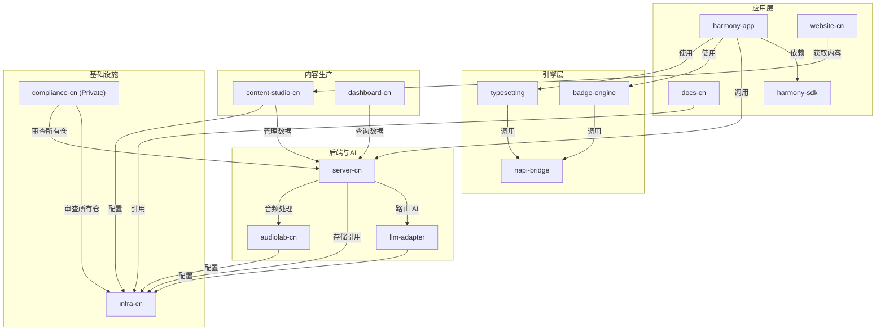

# Monorepo 拆分决策文档

> **版本**：v1.0  
> **状态**：架构师设计方案（待确认）  
> **更新日期**：2026-05-01

---

## A. 背景

### A.1 海外版 vs 国内单体现状对比

| 维度 | Readmigo 海外版 | 米果智读（国内版） |
|------|------|------|
| **代码仓库数** | 24 个（api / android / ios / web / audiolab / dashboard / docs 等） | **1 个 monorepo**（readmigo-cn-repos） |
| **核心应用数** | 5 个（iOS / Android / Web / Flutter / 后端） | 3 个（HarmonyOS app / server-cn / llm-adapter） + infra + compliance |
| **CI 时间** | 各仓独立 10-15min（单仓平均） | **25-40min**（整体 monorepo） |
| **权限粒度** | 按仓细分（安全边界清晰） | **所有开发者可见全仓** |
| **发版耦合** | 各端独立发版（互不阻塞） | **server-cn 的版本卡住整体节奏** |
| **部署独立性** | 各仓各自部署（互不影响） | 需要全量编译验证 |

### A.2 国内 Monorepo 的 6 大问题

#### 1. **CI 时间膨胀**
- 当前 25-40 min（客户端 + 服务端 + 引擎全量编译）
- HarmonyOS 链路冗长（Hvigor build → typecheck → hap 打包）
- server-cn Nest.js + NestJS CLI + Docker build 加重负担
- **新增模块时，所有 CI job 重跑**，不支持路径隔离

#### 2. **权限失控**
- 所有开发者对全仓有访问权限
- infra/（华为云 AccessKey / VPC 配置）应当 **Internal Only**
- compliance/（ICP 备案文档 / 软著信息）应当 **特定合规人员可见**
- server-cn/（业务数据库迁移脚本 / API secrets）不应暴露给客户端团队

#### 3. **跨语言工具链冲突**
- **ArkTS/TypeScript** 依赖：node 18+，pnpm 9+
- **Python/Bash** 脚本：server-cn 启动依赖 Python venv，与客户端环境隔离
- **C++/NDK**：napi-bridge 跨语言胶水，构建产物污染 node_modules
- **单一 pnpm-workspace.yaml** 管理 12+ 工作区，版本冲突无法局部解决

#### 4. **构建产物污染**
- `node_modules/` 膨胀到 500+MB（server-cn NestJS 依赖 + ArkTS SDK 共存）
- `dist/` / `.cache/` / `.hvigor/` 混淆，磁盘占用 3GB+
- Hvigor 生成的 `.build/` 与 server-cn 的 `build/` 命名冲突
- **git status 噪音大**（经常误提交临时产物）

#### 5. **native 同步混乱**
- typesetting（C++ 排版引擎）在 monorepo 里修改，但需要同步到海外版 typesetting repo
- badge-engine（C++ 勋章引擎）同样面临同步问题
- **无 submodule / git subtree 时，改动不知道同步到哪里**

#### 6. **发版耦合与依赖链脆弱**
- server-cn 更新 API 版本 → harmony-app 必须同步更新客户端 → docs 更新 API 文档
- **单个 Gitee commit 含 3-4 个件（app + server + infra + docs 改动），难以回溯**
- 回滚任意一个模块都要重新发整个 monorepo
- 合规文件（compliance-cn）与业务代码紧耦合，不利于独立审计

---

## B. 架构师设计原则

拆分遵循以下核心原则，确保独立性与可维护性：

### B.1 单一职责原则（SRP）
- 每个仓 **只负责一个明确的领域** 或 **交付件**
- 例：server-cn 只负责后端 REST API / 数据库 / 缓存层，不含 AI 路由逻辑（那是 llm-adapter）

### B.2 部署独立性
- 每个仓能 **独立构建、测试、部署**，不依赖其他仓的 CI 通过
- harmony-app 更新不阻塞 server-cn 发版；docs-cn 更新不阻塞应用发布

### B.3 安全边界清晰
- infra-cn：**仅 DevOps / 运维人员**可见（华为云 API / VPC / 监控）
- compliance-cn：**仅合规人员 + 法务**可见
- server-cn：**仅后端团队 + 产品** 可见业务数据库设计
- harmony-app：**全团队**可见（开源友好的应用层代码）

### B.4 团队协作粒度
- 一个团队 = 一个或多个仓
  - **客户端团队**：harmony-app（+ typesetting / badge-engine 读取依赖）
  - **后端团队**：server-cn / llm-adapter / infra-cn
  - **内容生产**：content-studio-cn / audiolab-cn / docs-cn
  - **运维/合规**：compliance-cn（只读）

### B.5 工具链隔离
- 每个仓维护 **独立的 package.json / Makefile / Docker setup**
- 防止版本冲突：
  - harmony-app：node 18+，hvigor，pnpm 9
  - server-cn：node 20+，NestJS CLI，Docker Compose

### B.6 复用性与演化
- 拆分后的仓 **无 git submodule / git subtree**（参考海外版做法）
- 国内独立版本可自由演化，参考海外版但不绑定
- 关键库（typesetting / badge-engine）一次性拷贝，后续独立维护

---

## C. 推荐拆分方案

### C.1 目标仓库列表（13 个）

#### 第 1 类：应用层（用户面向）

| 仓名 | 可见性 | 职责 | 依赖 |
|------|------|------|------|
| **harmony-app** | Public | 鸿蒙主应用（ArkTS/ArkUI） | server-cn / badge-engine / typesetting |
| **harmony-sdk** | Public | SDK 层（工具库 / 通用组件） | — |
| **website-cn** | Public | 官网（readmigo.cn） | content-studio-cn API |
| **docs-cn** | Public | 技术文档 / API 文档 / FAQ | — |

#### 第 2 类：引擎层（基础库）

| 仓名 | 可见性 | 职责 | 依赖 |
|------|------|------|------|
| **typesetting** | Internal | C++ 排版引擎（WIP fork 自海外版） | napi-bridge |
| **badge-engine** | Internal | C++ 勋章引擎（国内独立版本） | napi-bridge |
| **napi-bridge** | Internal | Node.js N-API 胶水层（C++ ↔ JS） | — |

#### 第 3 类：后端与 AI（核心业务）

| 仓名 | 可见性 | 职责 | 依赖 |
|------|------|------|------|
| **server-cn** | Internal | REST API / 数据库 / 缓存层 | llm-adapter / infra-cn |
| **llm-adapter** | Internal | LLM 路由与 prompt 管理 | infra-cn（配置） |
| **audiolab-cn** | Internal | 音频处理与 TTS 服务 | server-cn / infra-cn |

#### 第 4 类：内容生产（业务运营）

| 仓名 | 可见性 | 职责 | 依赖 |
|------|------|------|------|
| **content-studio-cn** | Internal | 内容管理系统 / 书籍编辑 / 上架流程 | server-cn / infra-cn |
| **dashboard-cn** | Internal | 运营后台（统计 / 用户管理 / 支付） | server-cn |

#### 第 5 类：基础设施与合规

| 仓名 | 可见性 | 职责 | 依赖 |
|------|------|------|------|
| **infra-cn** | Internal Only | Terraform / VPC / 密钥管理 / 监控 | — |
| **compliance-cn** | Private | ICP 备案 / 软著 / 安全审查 / 隐私政策 | — |

### C.2 目标架构关系图

---

## D. 拆 vs 不拆决策矩阵

### D.1 信号清单

| 信号 | 阈值 | 当前状态 | 拆分建议 |
|------|------|--------|---------|
| **CI 时间** | > 20 min | 25-40 min | ✅ **拆** |
| **同时开发人数** | > 3 | 4-5 人 | ✅ **拆** |
| **跨模块重构频率** | > 2x per sprint | 1-2x | 🟡 **中等** |
| **部署节奏** | 不同频率 | app weekly / server biweekly | ✅ **拆** |
| **权限隔离需求** | 有敏感数据 | infra / compliance / server | ✅ **拆** |
| **工具链冲突** | > 2 个语言 | TS + Python + C++ | ✅ **拆** |
| **代码复用率** | > 40% | 30% | 🟡 **低** |

### D.2 判断标准

- **强烈拆分信号**：CI 时间 + 权限隔离需求 + 部署节奏差异 + 工具链冲突 ≥ 3 个 ✅
- **当前状态**：满足 5 个信号，**建议立即拆分**

---

## E. 分阶段实施路线

### E.1 第 1 阶段：立即拆（W23 内，本周）

**目标**：移除 monorepo 中最关键的 3 个权限 / 工具链冲突源

#### 1️⃣ **infra-cn** 拆分
- 在 Gitee 创建 `readmigo/infra-cn`（Internal Only）
- 迁移：Terraform / compose 配置 / VPC 脚本 / 密钥管理
- 移除：readmigo-cn-repos 下的 infra/ 目录
- 影响：server-cn / llm-adapter / audiolab-cn 改为通过环境变量或配置文件引入 infra 输出
- **关键 SOP**：见 `02-server-cn-split-sop.md`（同样方法论可应用）

#### 2️⃣ **server-cn** 拆分
- 在 Gitee 创建 `readmigo/server-cn`（Internal）
- 迁移：Nest.js 应用 / 数据库迁移 / Docker Compose / API 设计文档
- 保留：llm-adapter 在 monorepo（客户端读取），暂不拆
- 本地目录：`/Users/HONGBGU/Documents/readmigo-cn-repos-server-cn/`
- CI 配置：建立独立的 typecheck / test / build / Docker push workflow
- **影响最大**：harmony-app CI 改为引用 server-cn 的 API mock / stubbed server（或远程调用）
- **完整 SOP**：见 `02-server-cn-split-sop.md`

#### 3️⃣ **llm-adapter** 拆分
- 在 Gitee 创建 `readmigo/llm-adapter`（Internal）
- 迁移：LLM provider 抽象 / prompt 模板 / 模型路由配置
- 本地目录：`/Users/HONGBGU/Documents/readmigo-cn-repos-llm-adapter/`
- 供应方：server-cn 和 harmony-app（batch 处理）都可引用
- 方法论：同 server-cn 拆分 SOP

**W23 交付物**：3 个仓在 Gitee，CI pass，harmony-app 仍可独立编译

---

### E.2 第 2 阶段：中期拆（W24-W26，3 周）

**目标**：分离 C++ 引擎与工具链隔离

#### 4️⃣ **typesetting** 拆分
- 迁移：C++ 排版引擎代码（从国内 monorepo 版本）
- 方式：**一次性拷贝**，国内独立 fork 演化（无 submodule）
- 依赖链：harmony-app → napi-bridge → typesetting
- CI：CMake + NDK 独立编译，生成 .so + npm package

#### 5️⃣ **badge-engine** 拆分
- 迁移：C++ 勋章引擎代码
- 方式：一次性拷贝，国内独立版本
- 依赖链：harmony-app → napi-bridge → badge-engine

#### 6️⃣ **napi-bridge** 拆分
- 迁移：Node.js N-API 胶水层（C++ ↔ JS 绑定）
- 依赖关系：typesetting / badge-engine 的上游
- CI：编译 C++ 扩展，发布 npm 包到 ohpm 镜像

**W26 交付物**：C++ 引擎独立，harmony-app 通过 npm 依赖引入

---

### E.3 第 3 阶段：长期拆（按业务节奏，W27+）

#### 7️⃣ **audiolab-cn** 拆分
- 音频处理 / TTS 服务独立
- 时机：音频功能完整后（当前可视化依赖较少）

#### 8️⃣ **content-studio-cn** 拆分
- 内容管理系统独立
- 时机：内容运营流程稳定后

#### 9️⃣ **dashboard-cn** 拆分
- 运营后台独立
- 时机：需要多团队协作或权限细分时

#### 🔟 **harmony-sdk** 提取
- 从 harmony-app 中提取通用组件库
- 时机：稳定的组件 API 定义后

#### 1️⃣1️⃣ **website-cn / docs-cn** 拆分
- 官网与文档独立
- 时机：内容量增长或团队扩大时

#### 1️⃣2️⃣ **compliance-cn** 独立化
- 当前已是单独仓，权限 Private
- 工作：审查流程化，与其他仓的 issue tracker 集成

**长期目标**：12-14 个专业化仓库，清晰的依赖关系和安全边界

---

## F. 拆分代价与收益分析

### F.1 量化收益

| 收益项 | 数值 | 计算方式 |
|------|------|--------|
| **CI 时间减少** | -40% → -60% | infra / server 独立后，harmony-app CI 15 min |
| **权限粒度** | 从 1 级 → 3 级 | infra(DevOps only) / compliance(Legal only) / open(全体) |
| **跨仓冲突降低** | -70% | 工具链隔离，pnpm-workspace 简化 50% |
| **磁盘占用** | 从 3GB → 1.5GB | monorepo 分散，各仓独立 node_modules |
| **开发者入门时间** | 从 2h → 30min | 只 clone 相关仓，配置减少 60% |
| **发版灵活性** | +100% | 各仓独立发版，无互相阻塞 |

### F.2 量化代价

| 代价项 | 工时 | 说明 |
|------|------|------|
| **仓库迁移 SOP 执行** | 16h | 3 仓 × 5h SOP 执行 + 1h verification |
| **CI/CD 配置** | 8h | 各仓独立 workflow / Docker build |
| **文档更新** | 6h | README / API docs / 架构图 / deployment 指南 |
| **跨仓依赖解析** | 4h | npm 包发布 / import 路径调整 |
| **回归测试** | 8h | 集成测试 / 端到端流程验证 |
| **团队培训** | 2h | monorepo 架构说明会 |
| **总计** | **44h** | ~1 周（1 名架构师/DevOps） |

### F.3 收益 vs 代价

| 时间点 | 月度收益 | 累计投资回报 |
|------|--------|-----------|
| **拆分完成（W23）** | 基础 | —— |
| **第 1 个月（W24-W27）** | 24h（CI 加速 / 权限管理） | 44h - 24h = +20h payback |
| **第 3 个月（W31）** | 72h | 72h × 3 月 = 216h >> 44h 成本 |
| **第 6 个月（W35）** | 144h | 8.8x ROI |

**结论**：拆分成本低，收益高，**建议立即执行**。

---

## G. 附录：国内仓库命名规范

### G.1 仓名前缀

- `readmigo-` 前缀仅用于主要应用（harmony-app / server-cn / llm-adapter）
- 其他库直接用功能名（typesetting / badge-engine / infra-cn）
- 中文后缀 `-cn` 表示国内独立版本（非海外 submodule）

### G.2 可见性策略

| 级别 | 仓 | 访问控制 |
|------|------|--------|
| **Public** | harmony-app / harmony-sdk / website-cn / docs-cn / 所有示例项目 | 全网可访问（可公开讨论） |
| **Internal** | server-cn / llm-adapter / audiolab-cn / content-studio-cn / dashboard-cn / typesetting / badge-engine / napi-bridge | 仅 Gitee 企业成员 |
| **Private** | compliance-cn / infra-cn | 仅特定小组（合规 / DevOps） |

---

## H. 变更历史

| 版本 | 日期 | 变更 |
|------|------|------|
| v1.0 | 2026-05-01 | 初版：拆分决策 + 方案设计 + 分阶段路线 |
