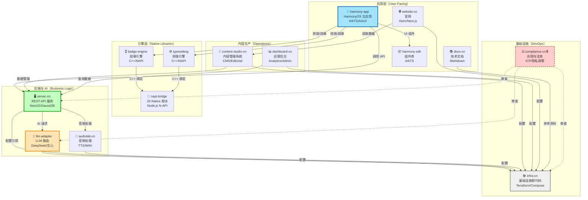
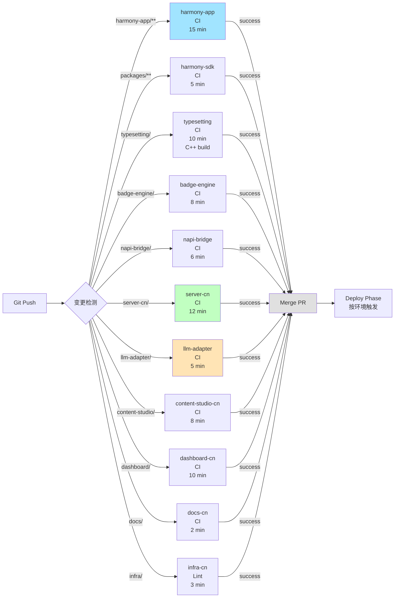
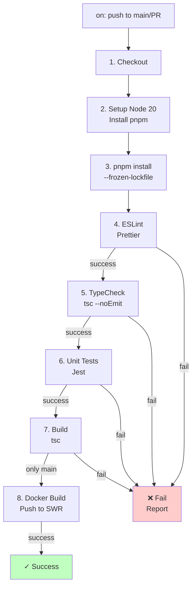
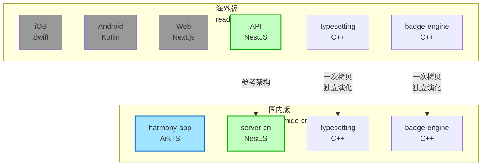
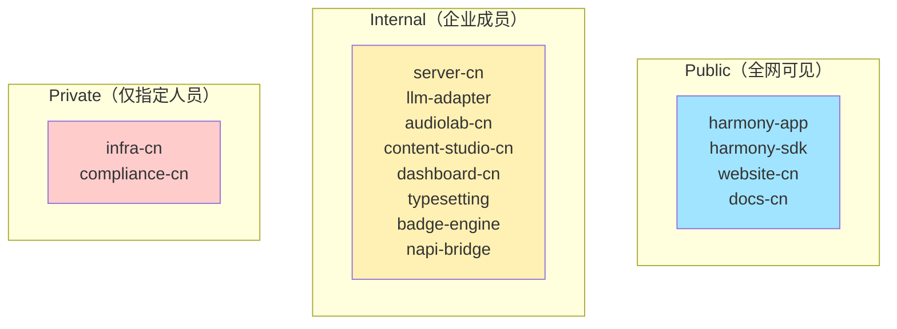
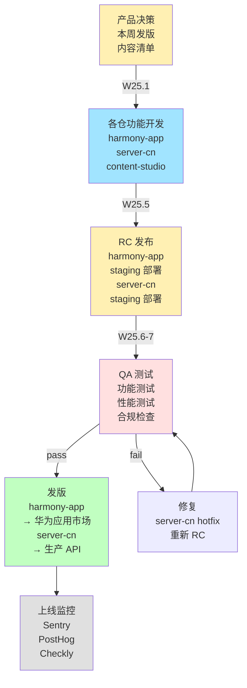

# 目标架构：13 仓体系设计

> **版本**：v1.0  
> **状态**：拆分完成后的最终形态  
> **目标时间**：W27+（随着拆分进度逐步演化）  
> **参考**：[01-repo-split-decision.md](./01-repo-split-decision.md) 拆分决策

---

## 概述

米果智读最终架构将由 13 个专业化仓库组成，分为 5 大类：**应用层**（4 仓）/ **引擎层**（3 仓）/ **后端与 AI**（3 仓）/ **内容生产**（2 仓）/ **基础设施**（2 仓）。

本文通过 **Mermaid 图** + **关系矩阵** + **部署拓扑** 说明目标形态。

---

## 1. 顶层组织结构

### 1.1 仓库体系全景图



### 1.2 仓库分类说明

| 分类 | 仓数 | 说明 | 团队 |
|------|------|------|------|
| **应用层** | 4 | 面向用户的应用与官网 | 客户端 + 前端 |
| **引擎层** | 3 | 高性能 C++ 库与 Node.js 绑定 | 平台 + Native |
| **后端与 AI** | 3 | 业务逻辑、API、LLM、音频 | 后端 + AI |
| **内容生产** | 2 | 内容管理与运营分析 | 运营 + 产品 |
| **基础设施** | 2 | 云资源、部署、合规 | DevOps + 法务 |

---

## 2. 详细依赖关系图

### 2.1 依赖类型说明

| 类型 | 符号 | 说明 |
|------|------|------|
| **强依赖** | `→` | 仓 A 必须依赖仓 B（无法独立运行） |
| **弱依赖** | `⟿` | 仓 A 可选地使用仓 B（降级策略） |
| **配置引用** | `↦` | 仓 A 引用仓 B 的基础设施配置 |
| **审查关系** | `⋯` | 仓 A 被仓 B 审查（单向） |

### 2.2 依赖矩阵

```
             harmony- harmony- website- docs- typeset- badge- napi- server- llm- audio- content- dash- infra- compli-
             app      sdk      cn       cn    ting     engine bridge cn      adapter cn   studio  board  cn     ance
harmony-app    -      ✓        -        -      ✓       ✓      -     ✓       -     -     -        -      -      -
harmony-sdk    -      -        -        -      -       -      -     -       -     -     -        -      -      -
website-cn     -      -        -        -      -       -      -     -       -     -     ✓        -      ↦      -
docs-cn        -      -        -        -      -       -      -     -       -     -     -        -      ↦      -
typesetting    -      -        -        -      -       -      ✓     -       -     -     -        -      -      -
badge-engine   -      -        -        -      -       -      ✓     -       -     -     -        -      -      -
napi-bridge    -      -        -        -      -       -      -     -       -     -     -        -      -      -
server-cn      -      -        -        -      -       -      -     -       ✓     ✓     ✓        ✓      ↦      -
llm-adapter    -      -        -        -      -       -      -     -       -     -     -        -      ↦      -
audiolab-cn    -      -        -        -      -       -      -     -       -     -     -        -      ↦      -
content-studio -      -        -        -      -       -      -     ✓       -     -     -        -      ↦      -
dashboard-cn   -      -        -        -      -       -      -     ✓       -     -     -        -      ↦      -
infra-cn       -      -        -        -      -       -      -     -       -     -     -        -      -      -
compliance-cn  -      -        -        -      -       -      -     ⋯       ⋯     ⋯     -        -      ⋯      -
```

**图例**：✓ = 强依赖，↦ = 配置引用，⋯ = 审查关系，- = 无关系

### 2.3 依赖深度分析

#### 第 0 层（基础层，无入站依赖）
- `napi-bridge` — 最底层
- `infra-cn` — 基础设施

#### 第 1 层（依赖基础层）
- `typesetting` → napi-bridge
- `badge-engine` → napi-bridge
- 所有服务 → infra-cn（配置）

#### 第 2 层（依赖第 1 层）
- `harmony-app` → typesetting / badge-engine / server-cn
- `server-cn` → llm-adapter / audiolab-cn
- `website-cn` → content-studio-cn

#### 第 3 层（最高层，可选依赖）
- `dashboard-cn` → server-cn
- `docs-cn` → 参考资料

#### 特殊：审查层（正交）
- `compliance-cn` 对 server-cn / llm-adapter / infra-cn 有只读审查权（不是运行时依赖）

---

## 3. CI/CD 流水线拓扑

### 3.1 并行构建策略



**关键特性**：
- **路径隔离**：`.gitee/workflows/ci.yml` 中每个仓有独立的 path filter
- **并行执行**：所有 CI job 同时运行（不阻塞彼此）
- **总耗时**：~15 min（最长的 harmony-app CI）vs. 原 monorepo 的 40 min
- **缓存策略**：各仓维护自己的 npm cache / build cache

### 3.2 单仓 CI 内流程

以 server-cn 为例：



**耗时分解**（server-cn）：
- Checkout + Setup: 1 min
- Install: 3 min
- Lint: 1 min
- TypeCheck: 2 min
- Tests: 3 min
- Build: 2 min
- **总计**: ~12 min

---

## 4. 部署拓扑（华为云）

### 4.1 环境分层

```mermaid
graph TB
  subgraph "开发环境（Dev）"
    dev_app["harmony-app<br/>Debug Build"]
    dev_api["server-cn<br/>localhost:3000"]
    dev_db["GaussDB<br/>Dev Instance"]
  end
  
  subgraph "测试环境（Test）"
    test_app["harmony-app<br/>Test Build"]
    test_api["server-cn<br/>test-api.readmigo.cn"]
    test_db["GaussDB<br/>Test Instance"]
    test_redis["Redis<br/>Test"]
  end
  
  subgraph "预发环境（Staging）"
    stage_app["harmony-app<br/>Release Build"]
    stage_api["server-cn<br/>staging-api.readmigo.cn"]
    stage_db["GaussDB<br/>Staging Instance"]
    stage_redis["Redis<br/>Staging"]
    stage_obs["OBS<br/>Staging"]
  end
  
  subgraph "生产环境（Production）"
    prod_app["harmony-app<br/>App Store Release"]
    prod_api["server-cn<br/>api.readmigo.cn"]
    prod_db["GaussDB<br/>Production"]
    prod_redis["Redis<br/>Production"]
    prod_obs["OBS<br/>Production"]
    prod_cdn["CDN<br/>加速"]
  end
  
  dev_app -.->|test| dev_api
  dev_api --> dev_db
  
  test_app -.->|verify| test_api
  test_api --> test_db
  test_api --> test_redis
  
  stage_app -.->|release candidate| stage_api
  stage_api --> stage_db
  stage_api --> stage_redis
  stage_api --> stage_obs
  
  prod_app -.->|users| prod_api
  prod_api --> prod_db
  prod_api --> prod_redis
  prod_api --> prod_obs
  prod_obs --> prod_cdn
  
  style dev_app fill:#e0f0ff
  style test_app fill:#fff0e0
  style stage_app fill:#f0ffe0
  style prod_app fill:#ffe0e0
```



### 4.2 仓与部署的对应关系

| 仓 | Dev | Test | Staging | Prod |
|------|------|------|---------|------|
| harmony-app | Xcode 直接运行 | Firebase TestFlight | TestFlight | 华为应用市场 |
| server-cn | localhost:3000 | test-api.readmigo.cn | staging-api.readmigo.cn | api.readmigo.cn |
| llm-adapter | 本地 mock | 按配置调用 Qwen | 按配置调用 Qwen | 按配置调用 Qwen |
| audiolab-cn | 本地 mock | test 实例 | staging 实例 | 生产实例 |
| content-studio-cn | localhost:3001 | content.test.readmigo.cn | content.staging.readmigo.cn | content.readmigo.cn |
| dashboard-cn | localhost:3002 | admin.test.readmigo.cn | admin.staging.readmigo.cn | admin.readmigo.cn |
| website-cn | localhost:3000 | readmigo.cn（staging） | readmigo.cn（staging） | readmigo.cn（prod） |
| docs-cn | localhost:4000 | docs.readmigo.cn（dev） | docs.readmigo.cn（staging） | docs.readmigo.cn（prod） |

---

## 5. 与海外版的关系图

### 5.1 代码复用矩阵



**同步规则**（参考 [11-readmigo-sync-matrix.md](../11-readmigo-sync-matrix.md)）：

| 模块 | 同步方式 | 说明 |
|------|--------|------|
| 领域设计 / 数据模型 | 🔄 参考 | 国内版可参考海外版的架构决策，但独立演化 |
| AI Provider 抽象 | 🔄 参考 | llm-adapter 模式可参考，provider 实现必须替换（OpenAI → DeepSeek） |
| 排版引擎（typesetting） | 📋 一次拷贝 | 初始从海外版拷贝，之后独立维护，无 submodule |
| 勋章引擎（badge-engine） | 📋 一次拷贝 | 初始从海外版拷贝，之后独立维护，无 submodule |
| REST API 设计 | 🔄 参考 | 端点结构参考，实现必须国内化（数据库 / 认证 / 支付） |
| 认证系统 | ❌ 不同步 | 海外 Firebase → 国内 AGC Phone Auth |
| 支付系统 | ❌ 不同步 | 海外 RevenueCat / Stripe → 国内 HMS IAP |
| 推送系统 | ❌ 不同步 | 海外 FCM → 国内 HMS Push |
| AI 对话 | ❌ 不同步 | 海外 OpenAI → 国内 DeepSeek / Qwen |

---

## 6. 跨仓 Cross-Reference 矩阵

### 6.1 npm 包依赖关系

```
harmony-app
├── @readmigo/harmony-sdk (internal npm)
├── @readmigo/badge-engine (internal npm)
├── @readmigo/typesetting (internal npm)
└── @readmigo/api-client (generated from server-cn OpenAPI)

server-cn
├── @readmigo/llm-adapter (internal npm)
└── @readmigo/infra-config (environment variables)

content-studio-cn
├── @readmigo/server-cn (via REST API, no direct npm dependency)
└── @readmigo/infra-config

dashboard-cn
├── @readmigo/server-cn (via REST API)
└── @readmigo/infra-config

harmony-sdk
└── (no dependencies, base library)

typesetting
├── napi-bridge (C++ binding)
└── (published as npm package)

badge-engine
├── napi-bridge (C++ binding)
└── (published as npm package)

napi-bridge
└── (base C++ binding library)
```

### 6.2 git 引用关系

| 源仓 | 目标仓 | 引用方式 | 更新频率 |
|------|------|---------|--------|
| harmony-app | server-cn | REST API 调用 | 实时 |
| harmony-app | typesetting | npm install | 发版时 |
| harmony-app | badge-engine | npm install | 发版时 |
| harmony-app | harmony-sdk | monorepo workspace（同仓） | 实时 |
| server-cn | llm-adapter | monorepo workspace（同仓） | 实时 |
| content-studio-cn | server-cn | REST API 调用 | 实时 |
| dashboard-cn | server-cn | REST API 调用 | 实时 |
| typesetting | napi-bridge | git submodule 或 npm | 发版时 |
| badge-engine | napi-bridge | git submodule 或 npm | 发版时 |
| docs-cn | 所有仓 | README / 文档链接 | 手工维护 |

---

## 7. 安全与权限模型

### 7.1 仓可见性与访问控制



### 7.2 团队权限分配

| 团队 | 仓 | 权限 | 说明 |
|------|------|------|------|
| **客户端** | harmony-app, harmony-sdk | Maintainer | 开发和发版 |
| **客户端** | typesetting, badge-engine, napi-bridge | Developer | 只读（或集成测试） |
| **后端** | server-cn, llm-adapter, audiolab-cn | Maintainer | 开发和发版 |
| **后端** | infra-cn | Developer | 只读基础设施配置 |
| **内容运营** | content-studio-cn, dashboard-cn | Maintainer | 开发和发版 |
| **内容运营** | server-cn | Developer | 只读 API 文档 |
| **DevOps** | infra-cn, compliance-cn | Maintainer | 部署和审查 |
| **法务** | compliance-cn | Maintainer | 审查和更新 |
| **所有人** | docs-cn, website-cn | Developer | 可提交 PR，由维护者合并 |

---

## 8. 发版流程与编排

### 8.1 应用发版流程



### 8.2 发版清单

| 时间点 | 检查项 | 责任人 |
|------|--------|--------|
| **发版决策后（T0）** | 需求 PRD 确认 / 功能清单 / 人力估算 | 产品 + 技术主管 |
| **发版前 1 周（T-7）** | 各仓 main 分支冻结 / RC 发布 / 灰度发布 | 项目经理 |
| **发版前 3 天（T-3）** | QA 测试计划 / 性能基线 / 安全检查 | QA + 安全 |
| **发版当日（T0）** | 华为应用市场提交 / server-cn 灰度 / 文档更新 | DevOps + 运营 |
| **发版后（T+1）** | 监控告警配置 / 日志聚合 / 用户反馈收集 | DevOps + 支持 |

---

## 9. 架构演化路线

### 9.1 短期（W23-W26）：拆分基础

```
readmigo-cn-repos (monorepo)
├── harmony-app
├── packages/llm-adapter ← 拆分为 server-cn 内子目录
├── server-cn ← 拆分为独立仓
├── infra/ ← 拆分为独立仓
└── docs/

后续：
✓ server-cn 独立（W23）
✓ infra-cn 独立（W24）
✓ llm-adapter 独立（W24）
✓ typesetting 独立（W25）
✓ badge-engine 独立（W25）
```

### 9.2 中期（W27-W35）：业务独立

```
服务端阵营：server-cn / llm-adapter / audiolab-cn
应用阵营：harmony-app / harmony-sdk
引擎阵营：typesetting / badge-engine / napi-bridge
运营阵营：content-studio-cn / dashboard-cn
基础设施：infra-cn / compliance-cn
前端/官网：website-cn / docs-cn
```

### 9.3 长期（W36+）：微服务演化

```
考虑方向（非近期）：
- 拆分 server-cn 为微服务（authz / book / user / payment）
- content-studio-cn 支持插件化
- 多 LLM provider 路由优化
```

---

## 10. 监控与可观测性

### 10.1 各仓关键指标

| 仓 | 指标 | 告警阈值 |
|------|------|--------|
| harmony-app | 崩溃率 | > 0.1% |
| harmony-app | 冷启动时间 | > 5s |
| server-cn | API P95 延迟 | > 500ms |
| server-cn | 错误率 | > 1% |
| server-cn | 数据库连接池 | > 80% |
| llm-adapter | 模型调用延迟 | > 3s |
| llm-adapter | 成本超额 | > 月度预算 110% |
| audiolab-cn | TTS 失败率 | > 2% |
| content-studio-cn | 发布延迟 | > 1min |
| infra-cn | 华为云配额使用 | > 85% |

### 10.2 跨仓依赖监控

```
harmony-app 健康 = 
  AppCrash < 0.1% AND
  ApiLatency < 500ms AND
  OfflineAvailable > 95%

server-cn 健康 = 
  ErrorRate < 1% AND
  DbConnections < 80% AND
  LLMLatency < 3s
```

---

## 附录：迁移时间表

| 里程碑 | 日期 | 拆分仓 | 预期 CI 时间 |
|------|------|--------|-----------|
| W23 | 2026-05-06 | infra-cn / server-cn / llm-adapter | 15 min（三仓并行） |
| W24 | 2026-05-13 | typesetting | 18 min（加 C++ build） |
| W25 | 2026-05-20 | badge-engine / napi-bridge | 18 min |
| W26 | 2026-05-27 | audiolab-cn（可选） | 20 min |
| W27 | 2026-06-03 | content-studio-cn | 22 min |
| W35 | 2026-07-29 | 目标架构完成 | 22 min（13 仓并行） |

---

## 变更历史

| 版本 | 日期 | 变更 |
|------|------|------|
| v1.0 | 2026-05-01 | 初版：13 仓完整架构设计 + 依赖图 + 部署拓扑 |
