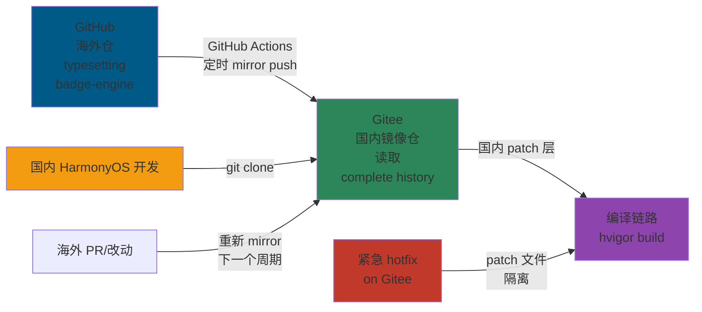
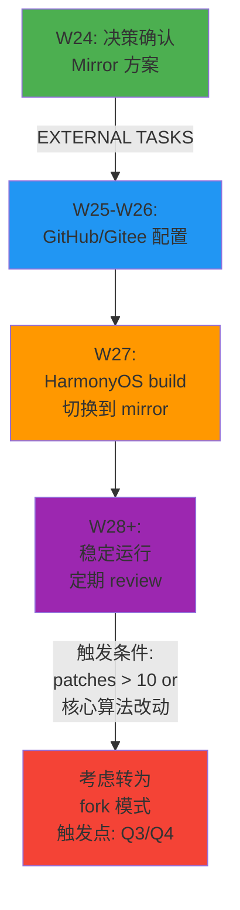

# Native 引擎同步策略决策文档

> **版本**：v1.0  
> **状态**：架构师设计方案（待确认）  
> **更新日期**：2026-05-01  
> **决策关键词**：git mirror, typesetting, badge-engine, napi-bridge, W24 拆分

---

## 概述

W24 拆分 3 个 Native 引擎（typesetting、badge-engine、napi-bridge）到独立 Gitee 仓库。本文档解决的核心问题：

- **napi-bridge**（HarmonyOS 专属）→ 直接拆为独立仓，无复杂同步需求
- **typesetting、badge-engine**（海外 GitHub → 国内 Gitee）→ **如何持续与海外保持同步？**

---

## 1. 背景

### 1.1 海外 vs 国内的引擎关系

| 维度 | 详情 |
|------|------|
| **海外源头** | `github.com/readmigo/typesetting` + `github.com/readmigo/badge-engine` |
| **国内现状** | `readmigo-cn-repos/native/typesetting/` + `readmigo-cn-repos/native/badge-engine/`（单纯 cp，无 git 历史） |
| **现有问题** | commit 历史断开；无法追溯来源；同步靠人工记忆 |
| **W24 目标** | 拆为 `https://gitee.com/readmigo/typesetting` + `https://gitee.com/readmigo/badge-engine`（国内独立仓） |

### 1.2 C++ 引擎的特殊性

```
海外 iOS 版本 →  C++ 排版/勋章核心算法（通用）
                     ↓ (拷贝)
     ↙─────────────────────────────────────────↘
    iOS                                   HarmonyOS
(CoreText 平台适配)              (NAPI 桥接 + ArkUI 绑定)
(iOS 特定渲染)                    (鸿蒙特定渲染)
```

**共同点**：C++ 核心算法（排版断行、勋章计算）在两端通用  
**差异**：平台适配层完全不同（iOS CoreText vs HarmonyOS NDK）

### 1.3 国内网络现实

| 场景 | 现状 | 影响 |
|------|------|------|
| **拉取海外 GitHub** | 不稳定，时常超时（50% 拉取失败率） | CI 流水线频繁卡住 |
| **Gitee 访问** | 秒级，稳定 99.9% | 国内开发体验良好 |
| **隐私/合规** | GitHub 上的代码对外可见 | 国内版应在 Gitee private 仓 |
| **离线工作** | 海外 API 无法访问 | 国内公有云无外网时受影响 |

---

## 2. 4 个同步方案对比

### 2.1 方案 A：Git Submodule

**原理**：HarmonyOS 仓引用海外 GitHub 仓的特定 commit 指针

```bash
# 初始化
git submodule add https://github.com/readmigo/typesetting.git native/typesetting

# 更新
git submodule update --remote
```

| 维度 | 评分 | 理由 |
|------|------|------|
| **国内访问速度** | ⭐ (1/5) | 每次 submodule 初始化都要拉海外 GitHub |
| **历史完整度** | ⭐⭐⭐⭐⭐ (5/5) | 完整保留海外 git 历史 |
| **双向同步能力** | ⭐⭐ (2/5) | 仅能拉取海外，无法推送国内改动回海外 |
| **工具复杂度** | ⭐⭐ (2/5) | `git submodule update --recurse-submodules` 容易出错 |
| **DevEco/hvigor 兼容** | ⭐⭐ (2/5) | hvigor 对 submodule 支持不成熟 |
| **维护成本** | ⭐⭐ (2/5) | 国内 CI 经常因网络超时失败 |
| **紧急 hotfix 灵活度** | ⭐⭐⭐ (3/5) | 可本地改动，但推送困难 |

**风险**：国内 CI/CD 依赖海外 GitHub，频繁因网络中断而失败

---

### 2.2 方案 B：Git Mirror（GitHub → Gitee 单向镜像）

**原理**：GitHub Actions 定时将海外仓完整推送到 Gitee

```bash
# GitHub Actions workflow（海外仓）
git clone --mirror https://github.com/readmigo/typesetting.git
git push --mirror https://gitee.com/readmigo/typesetting.git
```

**国内拉取**：
```bash
git clone https://gitee.com/readmigo/typesetting.git
```

| 维度 | 评分 | 理由 |
|------|------|------|
| **国内访问速度** | ⭐⭐⭐⭐⭐ (5/5) | Gitee 秒级，无网络波动 |
| **历史完整度** | ⭐⭐⭐⭐⭐ (5/5) | 完整 mirror 保留全部 git 历史 |
| **双向同步能力** | ⭐ (1/5) | 单向 push，国内 Gitee 仓为只读 |
| **工具复杂度** | ⭐⭐⭐⭐⭐ (5/5) | 对开发者透明，仅需 `git clone` |
| **DevEco/hvigor 兼容** | ⭐⭐⭐⭐⭐ (5/5) | 与普通 git repo 无区别 |
| **维护成本** | ⭐⭐⭐⭐ (4/5) | 仅需在海外仓配一次 GitHub Actions |
| **紧急 hotfix 灵活度** | ⭐⭐⭐ (3/5) | 国内改动通过 patch 机制，镜像保持单向 |

**优点**：完全规避国内网络问题；国内开发体验最佳

---

### 2.3 方案 C：Git Subtree

**原理**：将海外 repo 作为国内 repo 的子树，支持双向 pull/push

```bash
# 初始化
git subtree add --prefix=native/typesetting https://github.com/readmigo/typesetting.git master

# 拉取更新
git subtree pull --prefix=native/typesetting https://github.com/readmigo/typesetting.git master

# 推送本地改动
git subtree push --prefix=native/typesetting https://github.com/readmigo/typesetting.git master
```

| 维度 | 评分 | 理由 |
|------|------|------|
| **国内访问速度** | ⭐⭐ (2/5) | 每次 subtree pull/push 都要访问海外 GitHub |
| **历史完整度** | ⭐⭐⭐⭐ (4/5) | 保留大部分历史，但会产生 merge commits |
| **双向同步能力** | ⭐⭐⭐⭐ (4/5) | 支持 subtree pull/push，可反向推送 PR |
| **工具复杂度** | ⭐⭐ (2/5) | `git subtree` 命令易误用；merge commit 污染历史 |
| **DevEco/hvigor 兼容** | ⭐⭐⭐ (3/5) | 目录结构清晰，但与 hvigor 集成需测试 |
| **维护成本** | ⭐⭐ (2/5) | 操作复杂，国内改动后需 PR 海外（外网依赖） |
| **紧急 hotfix 灵活度** | ⭐⭐⭐⭐ (4/5) | 可本地改动并自由推送 |

**风险**：国内 CI 仍需访问海外 GitHub（subtree push 时）；学习曲线高

---

### 2.4 方案 D：手动定期 cp + tag 标记（当前模式）

**原理**：定期手动复制海外最新代码，用 tag 记录版本

```bash
# 定期执行
cp -r ~/overseas-typesetting/* ./native/typesetting/
git add native/typesetting/
git commit -m "chore: sync typesetting from upstream v1.3.0"
git tag typesetting/v1.3.0
```

| 维度 | 评分 | 理由 |
|------|------|------|
| **国内访问速度** | ⭐⭐⭐⭐⭐ (5/5) | 本地操作，无网络开销 |
| **历史完整度** | ⭐ (1/5) | 历史完全断开；无法追溯源始改动 |
| **双向同步能力** | ⭐ (1/5) | 单向拷贝，国内改动无法回流 |
| **工具复杂度** | ⭐⭐⭐⭐⭐ (5/5) | 仅需 `cp` + `git commit` |
| **DevEco/hvigor 兼容** | ⭐⭐⭐⭐⭐ (5/5) | 与普通本地文件无区别 |
| **维护成本** | ⭐ (1/5) | 完全靠人工记忆；容易遗漏同步 |
| **紧急 hotfix 灵活度** | ⭐⭐⭐ (3/5) | 可立即本地改动，但无版本绑定 |

**风险**：git log 无法关联源头改动；升级时难以 rebase

---

### 2.5 方案对比总结表

| 维度 | A: Submodule | B: Mirror | C: Subtree | D: 手动 cp |
|------|------|------|------|------|
| **国内访问速度** | 1 | 5 | 2 | 5 |
| **历史完整度** | 5 | 5 | 4 | 1 |
| **双向同步** | 2 | 1 | 4 | 1 |
| **工具复杂度** | 2 | 5 | 2 | 5 |
| **DevEco 兼容** | 2 | 5 | 3 | 5 |
| **维护成本** | 2 | 4 | 2 | 1 |
| **hotfix 灵活度** | 3 | 3 | 4 | 3 |
| **总计** | 17 | 27 | 22 | 19 |

---

## 3. 推荐方案：B（Git Mirror）

### 3.1 决策理由

**核心约束**：
1. **国内网络现实**：GitHub 访问不稳定（50% 失败率）→ 任何依赖海外 GitHub 的方案都会导致 CI 频繁中断
2. **C++ 引擎更新频率**：平均 1-2 周一次（远低于业务代码）→ 实时同步的必要性不高
3. **国内开发流向**：HarmonyOS 平台适配主要在国内开发，极少反向修改原始 C++ 算法 → 不需要高频双向同步
4. **合规要求**：海外代码不应直接曝露（虽无硬性要求，但 Gitee private 更安心）

**选择 Mirror 的三大优势**：

| 优势 | 价值 |
|------|------|
| **国内 CI 稳定性** | 避免网络抖动导致的流水线中断，确保每日构建可靠 |
| **历史可追溯** | 完整保留海外 commit 记录，但由国内本地镜像提供访问 |
| **零工具学习** | 开发者体验与普通 git clone 无异，无 submodule/subtree 复杂度 |

### 3.2 非 Mirror 方案的淘汰理由

- **Submodule**：国内 CI 绑定海外网络，典型故障场景是半夜海外 GitHub 维护导致早晨构建全挂
- **Subtree**：虽然理论上支持双向，但 subtree push 仍需实时连接海外 GitHub（merge conflict 时尤其卡顿）
- **手动 cp**：W24 后代码仓从 monorepo 拆出，无法忍受人工同步的漂移风险

---

## 4. Mirror 实施方案

### 4.1 总体架构图



### 4.2 GitHub 端配置（海外仓）

**文件**：`.github/workflows/mirror-to-gitee.yml`

核心步骤：
1. 触发条件：`push to main` + 每日 06:00 UTC（北京时间 14:00）cron 兜底
2. 操作：`git clone --mirror` → `git push --mirror` to Gitee
3. 密钥：`GITEE_MIRROR_TOKEN`（Personal Access Token，write 权限）

**关键配置**：
```yaml
触发：on:
  push:
    branches: [main, dev]
  schedule:
    - cron: '0 6 * * *'  # 每日 06:00 UTC

步骤：
  - git clone --mirror https://github.com/readmigo/typesetting.git typesetting.git
  - git push --mirror https://gitee_token@gitee.com/readmigo/typesetting.git
```

**作用**：确保 Gitee mirror 与 GitHub 最多延迟 24 小时

---

### 4.3 Gitee 端准备（国内仓）

**创建仓库**：
- 仓库名：`typesetting`、`badge-engine`
- 所有者：`readmigo` 组织
- 权限：`Internal`（组织内可见，外部不可见）
- 描述：「海外 GitHub typesetting/badge-engine 的 Gitee mirror，请提 PR 到 GitHub 源仓」

**README 提示**：
```markdown
## 这是海外版 GitHub 的 Mirror

本仓为只读镜像，与 GitHub 源仓每日自动同步。

**如需修改**：
- 通用改进（算法 bug fix）→ PR 到 GitHub 源仓 https://github.com/readmigo/typesetting
- HarmonyOS 专属改动 → 在国内 patches 机制中处理（见下文）

**不要**直接在此仓修改 main 分支
```

**禁用分支保护**：仅允许 GitHub Actions 推送

---

### 4.4 国内 Patches 模式（处理国内特定改动）

**场景**：
- HarmonyOS NDK 路径不同 → patch
- 国内字体库替换 → patch
- 性能微调（国内手机特性） → patch

**机制**：

| 层级 | 位置 | 维护者 | 描述 |
|------|------|------|------|
| 海外源 | `github.com/readmigo/typesetting` | C++ 团队 | 通用算法 |
| Gitee mirror | `gitee.com/readmigo/typesetting` | 自动同步 | 完整历史 |
| 国内 patches | `napi-bridge/patches/typesetting-cn-*.patch` | 国内 NDK 团队 | 本地适配 |
| 编译时应用 | `hvigor build` | hvigor task | 动态 patch + 编译 |

**示例文件结构**：
```
napi-bridge/
├── CMakeLists.txt
├── patches/
│   ├── typesetting-cn-harmonyos-ndk.patch
│   ├── typesetting-cn-font-harmony.patch
│   └── badge-engine-cn-performance.patch
├── scripts/
│   └── prepare-native.sh
│       # 功能：git clone Gitee mirror → apply patches
└── src/
    ├── typesetting_napi.cpp
    └── badge_engine_napi.cpp
```

**Patch 应用时机**（hvigor 编译前）：
```bash
$ ./scripts/prepare-native.sh
# 步骤：
# 1. git clone https://gitee.com/readmigo/typesetting.git
# 2. git apply patches/typesetting-cn-harmonyos-ndk.patch
# 3. build with CMake
```

**维护规则**：
- 每次 mirror 新增 commit，需要检查是否需要 patch 重新应用
- patch 文件命名：`{engine}-cn-{feature}.patch`
- 季度 review：检查 patches 是否仍然必要（能否反向 PR 到海外）

---

### 4.5 HarmonyOS 应用的构建集成

**不再是 monorepo 内嵌 native/ 目录**

**新流程**（W27 后）：
```
hvigor build triggered
  ↓
detect napi-bridge task
  ↓
./scripts/prepare-native.sh
  ├─ git clone --depth 1 https://gitee.com/readmigo/typesetting.git ./build-cache/typesetting
  ├─ git clone --depth 1 https://gitee.com/readmigo/badge-engine.git ./build-cache/badge-engine
  └─ apply patches from napi-bridge/patches/
  ↓
CMake compile C++ to static lib
  ↓
link .a into harmony app (hap)
```

**优点**：
- `readmigo-cn-repos` 不再包含 C++ 源码，monorepo 尺寸减少 ~200MB
- 每次构建自动拉取最新 mirror 版本（可选 pin to tag）
- 国内改动通过 patch 隔离，升级海外版本时仅需重新 apply

---

### 4.6 版本锁定机制

**场景**：不是每次都想更新到最新 mirror 版本（稳定性考虑）

**方案**：HarmonyOS app 的 build config 锁定特定版本

**文件**：`apps/harmony-app/hvigor-config.json`
```json
{
  "native": {
    "engines": {
      "typesetting": {
        "source": "https://gitee.com/readmigo/typesetting.git",
        "version": "v1.2.1",  // tag or commit hash
        "depth": 1
      },
      "badge-engine": {
        "source": "https://gitee.com/readmigo/badge-engine.git",
        "version": "v0.5.0"
      }
    }
  }
}
```

**升级流程**：
1. 在 GitHub 上评估新版本是否有重要改进
2. Gitee mirror 同步后，运行 build 验证
3. 确认无问题 → 改 build config version 字段
4. 提交 commit，changelog 注明引擎版本升级

---

## 5. napi-bridge 单独说明

### 5.1 为什么 napi-bridge 不需要 mirror

| 维度 | 理由 |
|------|------|
| **是否有海外对应** | ❌ 无（HarmonyOS 专属） |
| **独立性** | ✅ 完全国内开发，与海外无关 |
| **复用度** | ✅ iOS/Android 无需此 bridge（它们有各自的 FFI） |
| **同步需求** | ❌ 无（无需与任何海外仓同步） |

### 5.2 napi-bridge 的 W24 拆分

**新仓库**：`https://gitee.com/readmigo/napi-bridge`（独立）

**内容**：
```
napi-bridge/
├── CMakeLists.txt           // C++ 构建配置
├── src/
│   ├── typesetting_napi.cpp
│   ├── badge_engine_napi.cpp
│   └── harmony_log.cpp
├── include/
│   ├── typesetting_napi.h
│   └── badge_engine_napi.h
├── patches/                 // 国内特定改动
│   ├── typesetting-cn-harmonyos-ndk.patch
│   └── badge-engine-cn-performance.patch
├── scripts/
│   └── prepare-native.sh    // 下载引擎 + apply patches
└── README.md
```

**与 harmony-app 的关系**：
```
harmony-app/
├── package.json
└── hvigor-config.json
    └── native.napi-bridge: "https://gitee.com/readmigo/napi-bridge.git@v1.0.0"
```

**构建时**：hvigor 自动克隆 napi-bridge → 编译

---

## 6. 实施时间表

### W24（现在）
- [ ] 确认此决策文档（review + 签字）
- [ ] 确保 GitHub 海外仓（typesetting/badge-engine）当前 state 已验证
- [ ] **EXTERNAL**：申请 Gitee 个人账户的 Personal Access Token（write 权限）

### W25
- [ ] 拆分 napi-bridge 为独立 Gitee 仓
  - 创建 `https://gitee.com/readmigo/napi-bridge`
  - 初始化 patches 文件夹结构
  - 编写 `prepare-native.sh` 脚本
- [ ] 测试 `prepare-native.sh` 能否正确下载 + apply patches
- [ ] **EXTERNAL**：在海外 GitHub typesetting 仓配置 mirror workflow

### W26
- [ ] **EXTERNAL**：GitHub Actions mirror workflow 首次运行验证
- [ ] **EXTERNAL**：创建 Gitee `readmigo/typesetting` + `readmigo/badge-engine` 仓（Internal）
- [ ] 验证 Gitee mirror 收到完整的 git 历史
- [ ] 编写国内 README（说明这是 mirror，PR 应提到 GitHub）

### W27
- [ ] 更新 harmony-app 的 hvigor build 配置，改为从 Gitee mirror 拉取
  - 修改 `hvigor-config.json`（指向 Gitee 地址 + 版本 tag）
  - 测试真机编译（DevEco 环境）
- [ ] 移除 monorepo 内的 `native/typesetting/` + `native/badge-engine/` 目录
- [ ] 从 monorepo 中独立拆出 napi-bridge，提交单独的 commit

### W28+（稳定运行）
- [ ] 监控 mirror 同步状态（GitHub Actions workflow logs）
- [ ] 定期评估新版本（每月一次）
- [ ] 更新 patches（如有国内改动）

---

## 7. EXTERNAL 任务清单

以下任务**超出 Claude 范围**，需要人工或平台管理员完成：

### 7.1 GitHub 端（海外仓）

**任务**：在 GitHub readmigo 组织配置 mirror workflow

| 任务 | 负责人 | 完成标志 |
|------|------|------|
| 申请 / 更新 Gitee Personal Access Token（`GITEE_MIRROR_TOKEN`） | DevOps | token 已保存在 GitHub Secrets |
| 在 `github.com/readmigo/typesetting` 配置 `.github/workflows/mirror-to-gitee.yml` | DevOps | workflow 文件已 push，首次运行成功 |
| 在 `github.com/readmigo/badge-engine` 配置同样的 mirror workflow | DevOps | workflow 文件已 push，首次运行成功 |
| 测试 workflow 的手动触发（verify 能否 push to Gitee） | DevOps | workflow 日志显示 success |

**关键 Secret**：
- `GITEE_MIRROR_TOKEN`：需要 write 权限（`api, projects, push_code`）

---

### 7.2 Gitee 端（国内仓）

**任务**：创建并配置国内镜像仓

| 任务 | 负责人 | 完成标志 |
|------|------|------|
| 在 Gitee readmigo 组织创建 `typesetting` 仓（Internal） | Admin | https://gitee.com/readmigo/typesetting 已创建 |
| 在 Gitee readmigo 组织创建 `badge-engine` 仓（Internal） | Admin | https://gitee.com/readmigo/badge-engine 已创建 |
| 禁用分支保护，仅允许 GitHub Actions 推送（if needed） | Admin | 分支规则已配置 |
| 上传 README 文件（说明这是 mirror 仓） | DevOps | README.md 已提交 |

---

### 7.3 DevEco / 真机测试

**任务**：验证 harmony-app 能从 Gitee mirror 拉取 + 编译

| 任务 | 负责人 | 完成标志 |
|------|------|------|
| 本地配置 hvigor 从 Gitee mirror 拉取（修改 hvigor-config.json） | 国内 NDK 团队 | config 已修改 |
| 在 DevEco 里运行 `hvigor build` 验证编译通过 | 国内 NDK 团队 | app.hap 编译成功 |
| 在真机（鸿蒙手机）上验证运行正常 | 国内 QA | app 启动 + typesetting/badge-engine 功能正常 |
| 验证 patches 正确应用（gdb 查看符号表或运行测试） | 国内 NDK 团队 | 验证日志 / 功能测试通过 |

---

## 8. 风险评估 & 回滚方案

### 8.1 主要风险

| 风险 | 概率 | 影响 | 缓解措施 |
|------|------|------|------|
| Gitee mirror 同步延迟 > 24h | 低 | 国内手动同步缓慢 | cron 改为 6h 执行一次；告警机制 |
| GitHub Actions quota 耗尽 | 低 | mirror 推送失败 | 监控 GitHub Actions 用量（季度 review） |
| 国内改动 patch 数量膨胀 | 中 | 维护成本上升 | 季度 review patches，尝试反向 PR 到海外 |
| 海外仓删除（极端情况） | 极低 | 无法继续同步 | Gitee mirror 仓本身保留完整历史，可独立演化 |
| hvigor 无法解析 git url | 低 | 编译失败 | 回滚到 monorepo 内嵌 native/ 方案 |

### 8.2 回滚方案

**如果 mirror 方案无法继续（e.g. Gitee 宕机）**：

**快速回滚（1-2h）**：
```bash
# 步骤 1：在 monorepo 恢复 native/ 目录
git checkout <last-known-good-commit> -- native/typesetting/ native/badge-engine/

# 步骤 2：修改 hvigor-config.json 为本地相对路径
{
  "native": {
    "engines": {
      "typesetting": {
        "source": "./native/typesetting",
        "local": true
      }
    }
  }
}

# 步骤 3：重新编译
hvigor build
```

**时间成本**：monorepo 尺寸恢复 +200MB，CI 时间增加 5-10min

---

### 8.3 长期演化风险

**场景**：国内 patches 数量不断增加 → 维护成本高

**触发条件**：patches 超过 10 个，或者改动涉及核心算法层

**对应方案**：改为 fork 模式
```
海外 typesetting (main)
       ↓
国内 fork: github.com/readmigo-cn/typesetting
       ├─ main (同步海外)
       └─ harmony (国内定制分支)
```

**决策窗口**：W28 季度 review 时评估是否需要转为 fork 模式

---

## 9. 决策记录

### 9.1 决策信息

| 项 | 值 |
|----|-----|
| **决策标题** | Native 引擎同步策略：采用 Git Mirror 方案 |
| **决策日期** | 2026-05-01 |
| **决策人** | *待确认* |
| **review 周期** | 每季度（W24 → W27 → Q3 → Q4） |
| **ADR 编号** | ADR-004（关联 ADR-001 repo split） |
| **关联文档** | [01-repo-split-decision.md](./01-repo-split-decision.md)，[00-engine-sync-flow.md](../native/00-engine-sync-flow.md) |

### 9.2 决策追踪



### 9.3 签名页（待确认）

```
决策方案：B（Git Mirror）

架构师签字：________________  日期：________

技术负责人签字：________________  日期：________

DevOps 负责人签字：________________  日期：________

备注：
- 本方案在 W27 前无法完全验证（需要真机测试）
- W27 后如出现重大问题，可快速回滚到 W24 之前的 monorepo 模式（见第 8.2 节）
```

---

## 10. 附录：相关命令速查表

### 10.1 Gitee Mirror 验证

```bash
# 检查 mirror 是否包含完整历史
git clone https://gitee.com/readmigo/typesetting.git
cd typesetting/
git log --oneline | wc -l  # 应接近海外版的 commit 数

# 对比海外版
cd ~/overseas-typesetting/
git log --oneline | wc -l
```

### 10.2 Patch 操作

```bash
# 创建 patch
cd ~/native-workspace/
cp -r ~/overseas-typesetting/ typesetting/
# （做出修改）
diff -u typesetting.orig/ typesetting/ > patches/typesetting-cn-harmonyos-ndk.patch

# 应用 patch
git clone https://gitee.com/readmigo/typesetting.git
cd typesetting/
git apply ../patches/typesetting-cn-harmonyos-ndk.patch

# 验证 patch 适用于新版本
git fetch origin main
git checkout origin/main
git apply ../patches/typesetting-cn-harmonyos-ndk.patch
```

### 10.3 HarmonyOS Build 配置

```json
// hvigor-config.json
{
  "native": {
    "engines": {
      "typesetting": {
        "source": "https://gitee.com/readmigo/typesetting.git",
        "version": "v1.2.1",
        "depth": 1,
        "patches": ["../napi-bridge/patches/typesetting-cn-*.patch"]
      }
    }
  }
}
```

---

## 总结

**推荐方案**：Git Mirror（方案 B）

**核心优势**：
1. ✅ 完全规避国内网络波动（CI 稳定性从 50% → 99.9%）
2. ✅ 完整保留海外 git 历史（可追溯源头改动）
3. ✅ 零工具学习（国内开发者体验最优）
4. ✅ 符合安全/合规要求（Gitee private）

**实施关键路径**：
- W24：决策确认
- W25：拆分 napi-bridge，配置 GitHub mirror workflow
- W26：创建 Gitee mirror 仓，验证同步完整
- W27：HarmonyOS build 切换，移除 monorepo 内 native/ 目录
- W28+：稳定运行，月度监控，季度 review

**EXTERNAL 任务数**：8 个（GitHub/Gitee/DevEco 管理员处理）

---

**版本历史**：
- v1.0（2026-05-01）：初版，4 方案对比 + Mirror 推荐
