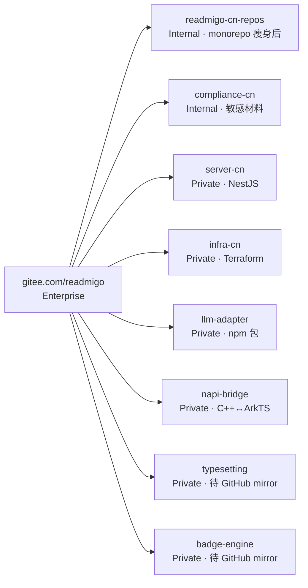

# Autonomous Continuation Playbook — W24+ 收尾自动化

> **目的**：在新终端窗口让 Claude Code 全自动跑完所有剩余收尾任务（α 文档对齐 + β 状态刷新 + γ apps 引用迁移 + δ mirror 自动化骨架），**不再询问任何 1/2 确认**，跑完汇总报告。
>
> **触发字**：本 prompt 内含 `agent team` 关键字，新会话会自动进入多 agent 编排模式（参见 `~/.claude/CLAUDE.md` "CRITICAL: Agent Team Trigger"）。
>
> **创建于**：2026-05-03，对应 commit `5a35265`（W24 native engines 拆分收官后）。

---

## 一、人类操作（30 秒）

```bash
# 1. 终端开新窗口
cd /Users/HONGBGU/Documents/readmigo-cn-repos

# 2. 启动 Claude Code
claude

# 3. 把本文 §三 START_PROMPT 到 END_PROMPT 之间整段粘进去，回车
# 4. 走开。中途不会问你任何问题。完成后会输出最终汇总，commit/push 全自动。
```

预期总耗时 ≈ 8-15 分钟（含 4 agents 并发 + 串行 commit）。

---

## 二、已知前提（agents 自动加载，**不需要你提供**）

| 资源 | 位置 | 校验命令 |
|---|---|---|
| Gitee PAT | `~/.gitee_token`（chmod 600） | `curl -s "https://gitee.com/api/v5/user?access_token=$(cat ~/.gitee_token)" \| python3 -c "import json,sys;print(json.load(sys.stdin).get('login'))"` |
| Gitee SSH alias | `~/.ssh/config` 内 `Host gitee-readmigo-cn` | `ssh -T git@gitee-readmigo-cn` 应返回 "successfully authenticated" |
| Monorepo | `/Users/HONGBGU/Documents/readmigo-cn-repos` | HEAD = `5a35265`（W24 收官） |
| Sibling 仓 | `~/Documents/readmigo-{server-cn,infra-cn,llm-adapter,napi-bridge,typesetting,badge-engine}` | `ls -d ~/Documents/readmigo-*` 应见 7 个 |
| Gitee 仓状态 | 8 个仓全 default_branch=main | 见 §四 |

---

## 三、START_PROMPT（粘给新 Claude 会话）

````
agent team — 全自动收尾 W24+ 剩余任务，不再询问 1/2 确认

## 上下文（你没有历史会话记忆，本 prompt 是唯一入口）

我刚完成 readmigo-cn-repos monorepo 的 W23-W24 拆分。当前状态：
- monorepo HEAD: 5a35265（refactor: 拆出 napi-bridge/typesetting/badge-engine）
- Gitee 已有 8 个仓: readmigo-cn-repos / server-cn / infra-cn / llm-adapter / napi-bridge / typesetting / badge-engine / compliance-cn
- 7 个 sibling 仓 clone 在 ~/Documents/readmigo-{server-cn,infra-cn,llm-adapter,napi-bridge,typesetting,badge-engine,...}
- ~/.gitee_token 已配置（admin scope on enterprise）
- SSH alias gitee-readmigo-cn 已配置

完整背景：阅读 /Users/HONGBGU/Documents/readmigo-cn-repos/docs/architecture/05-autonomous-continuation-playbook.md 第 §四 §五 节。

## 自动模式硬规则（覆盖默认行为）

1. **不要问"1 或 2"**。所有决策已在 §五 预先定好，照执行。
2. **不要 EnterPlanMode**。直接干。
3. **失败不暂停**：单个子任务失败 → 重试 1 次 → 仍失败 → 写入 /tmp/autonomous-continuation-errors.log，继续后面任务。
4. **commit + push 自动**：每个 phase 结束直接 `git add → commit → push`，遵守 ~/.claude/CLAUDE.md 的 commit message 规则（无 Claude attribution）。
5. **跨仓改动**：每个 sibling 仓自己 commit + push，monorepo 单独 commit + push。
6. **完成判定**：跑完所有 4 个 phase + 最终汇总后才结束。汇总用表格写明每个 phase 的 commit SHA + push 结果。

## 任务编排（4 phases，A+B 并行 → C 串行 → D 并行）

用 TeamCreate 建团队 `w24-finalize`，再用 Task(team_name="w24-finalize") 派遣以下 agents：

### Phase A（并行启动）— documentation-expert
**目标**：刷新 docs/40-gitee-repo-structure.md 让其反映真实 Gitee 状态

**确切改动**：
1. "拆分进度" 表格中：
   - `napi-bridge` 状态 `🟡 W24 进行中` → `✅ W23 完成（实际 Private）`
   - `typesetting` 状态 `🟡 W25-W26` → `✅ W23 完成（实际 Private，待 GitHub mirror）`
   - `badge-engine` 状态 `🟡 W25-W26` → `✅ W23 完成（实际 Private，待 GitHub mirror）`
2. "现状" 章节的 mermaid 图 + 表格：把 napi-bridge / typesetting / badge-engine 三个新仓加进去（参考 server-cn 行的写法）
3. 文档顶部的 "2026-05-03 状态更新" 章节追加：
   ```
   W24 拆分完成（同日内推进）:
   - ✅ napi-bridge (Private)
   - ✅ typesetting (Private, 待 GitHub mirror)
   - ✅ badge-engine (Private, 待 GitHub mirror)
   ```
4. "可见性规则" 表格下方加 callout：
   > **现状校准**：基础设施 + 业务代码仓 (`server-cn`/`infra-cn`/`llm-adapter`/`napi-bridge`/`typesetting`/`badge-engine`) 当前 Gitee API 创建后均为 Private。Gitee Enterprise API 不支持设 Internal，需 web UI 手动改。docs 此前标的 Internal 是规划目标，未与实际状态对齐 → 本次校准后表示真实状态。

5. 删除文末"W24-W26 计划拆分"节（已成历史）。

**完成条件**：grep `40-gitee-repo-structure.md` 已无 `🟡` 字符。

---

### Phase B（并行启动）— documentation-expert
**目标**：扫其他 9 篇 docs/*.md 里残留的 napi-bridge / typesetting / badge-engine "未拆 / 计划中" 字样，统一改为 "已拆出"

**扫描范围**：`docs/01-tech-selection.md` `docs/02-architecture.md` `docs/03-overseas-reuse.md` `docs/05-roadmap.md` `docs/08-deveco-setup.md` `docs/10-domestic-stack-integration.md` `docs/12-fullstack-technical-spec.md` `docs/30-4-track-initiation-summary.md` `docs/50-execution-orchestration.md`

**改动模式**：
- "monorepo 内 napi-bridge/" → "独立仓 [`napi-bridge`](https://gitee.com/readmigo/napi-bridge)"
- "native/typesetting" → "独立仓 [`typesetting`](https://gitee.com/readmigo/typesetting)"
- "native/badge-engine" → "独立仓 [`badge-engine`](https://gitee.com/readmigo/badge-engine)"
- "W24 计划 / W25-W26 计划" 涉及上述 3 仓的 → 改 "W23 已完成"

只改语义引用，不动技术内容（cmake / cpp 代码示例不变）。

**完成条件**：上述 9 篇里 `grep -E "napi-bridge|typesetting|badge-engine"` 出来的行，路径都指向独立仓 URL 或 sibling 路径，无 `native/` 前缀。

---

### Phase C（C 串行，等 A+B 完成）— 由主 agent 执行
**目标**：commit + push docs 改动到 monorepo

```bash
cd /Users/HONGBGU/Documents/readmigo-cn-repos
git add docs/
git status --short  # 应只见 M docs/...
git commit -m "$(cat <<'EOF'
docs(W24 收尾): 全文档对齐 native engine 实际拆分状态

- 40-gitee-repo-structure: napi-bridge/typesetting/badge-engine 标 ✅ + 现状校准
- 其他 9 篇: 路径引用从 monorepo 内 → 独立 Gitee 仓
- 可见性现状校准: 6 个工程仓实际 Private（Gitee API 限制）
EOF
)"
git push origin main
```

记录 commit SHA，用于最终汇总。

---

### Phase D（并行启动）— 同时跑两个 agent

**D1: legacy-modernizer**
**目标**：apps/harmony-app 内残留的 `napi-bridge/` 路径引用迁移到 sibling

**任务**：
1. `grep -rE "napi-bridge|native/typesetting|native/badge-engine" apps/harmony-app/ --include="*.json5" --include="*.json" --include="*.ets" --include="*.ts" --include="*.gn"`
2. 每条匹配判断：
   - oh-package.json5 / build-profile.json5 内的 `file:../../napi-bridge` 类引用 → 改 `file:../../../readmigo-napi-bridge`（指 sibling）
   - 注释 / 文档字符串内 → 路径改对应 Gitee URL
3. 改完跑 `cd apps/harmony-app && pnpm install --frozen-lockfile=false 2>&1 | tail -20`，确认无 ENOENT
4. commit 信息：`refactor(harmony-app): 引用迁移 napi-bridge → sibling 仓`

如果 grep 命中 0 条 → 跳过，输出 "no migration needed"。

**D2: deployment-engineer**
**目标**：在 monorepo 写出 GitHub mirror workflow 模板（仅模板文件，不入海外仓）

**任务**：
1. 写 `docs/architecture/templates/mirror-typesetting-to-gitee.yml`（GitHub Actions YAML）
2. 写 `docs/architecture/templates/mirror-badge-engine-to-gitee.yml`
3. 内容参考 sibling 仓 `~/Documents/readmigo-typesetting/MIRROR_SOP.md` 的 yaml 块
4. 在文件顶部加注释：
   ```
   # 用法：复制到 https://github.com/readmigo/typesetting 的
   #      .github/workflows/mirror-to-gitee.yml，配置 secrets.GITEE_TOKEN
   # 不要直接放 gitee 这边的仓库
   ```
5. commit 信息：`docs(mirror): GitHub Actions mirror workflow 模板`

---

### Phase E（最后串行）— 由主 agent 执行
**目标**：最终汇总 + push

```bash
cd /Users/HONGBGU/Documents/readmigo-cn-repos
git status --short  # D1+D2 的改动
git add -A
git commit -m "..." # 见 D1/D2 各自描述
git push origin main
```

输出最终汇总表格：

| Phase | Agent | Commit SHA | Push |
|---|---|---|---|
| A | documentation-expert | xxxxxxx | ✅ |
| B | documentation-expert | (合并到 Phase C commit) | — |
| C | main | yyyyyyy | ✅ |
| D1 | legacy-modernizer | zzzzzzz | ✅ |
| D2 | deployment-engineer | wwwwwww | ✅ |

如果 /tmp/autonomous-continuation-errors.log 非空，附上失败列表。

---

## 完成判定（你不结束直到全部满足）

- [ ] `git log --oneline | head -5` 至少 2 个新 commit（Phase C + Phase E）
- [ ] `git status --short` 干净（除 hvigor cache 已 gitignored）
- [ ] `cd ~/Documents/readmigo-cn-repos && grep -rE "🟡.*W2[4-6]" docs/40-gitee-repo-structure.md` 无输出
- [ ] `ls docs/architecture/templates/*.yml | wc -l` >= 2
- [ ] git push 全部成功（grep ".*-> main" 输出 >= 2）

输出最终汇总后即可结束本 session。
````

---

## 四、Gitee 仓现状（snapshot @ 2026-05-03）



| Repo | Visibility（API 实测） | 用途 |
|---|---|---|
| readmigo-cn-repos | Internal | apps/harmony-app + compliance + docs + scripts + tools |
| compliance-cn | Internal | 公司资质 + 敏感材料 |
| server-cn | Private | 后端 NestJS |
| infra-cn | Private | Terraform + 华为云 |
| llm-adapter | Private | 国产 LLM npm 包 |
| napi-bridge | Private | HarmonyOS C++↔ArkTS 桥 |
| typesetting | Private | 跨平台排版 C++（GitHub 主，Gitee 镜像） |
| badge-engine | Private | 跨平台徽章 C++（GitHub 主，Gitee 镜像） |

---

## 五、预先决策（agent 不需要再问）

| 决策点 | 已选方案 | 理由 |
|---|---|---|
| α-可见性偏差 | **改文档（标记真实 Private 状态）** | Gitee Enterprise API 不支持设 Internal；改 7 个仓的 web UI 是人工动作，违背"无需人为干预"前提 |
| β-状态时态 | **刷成 ✅ W23 完成** | 已实际落地，文档时态需修正 |
| γ-apps 引用迁移 | **migrate to sibling 路径** | sibling 已 clone，本地 dev 链路最简；待 mirror 自动化后再考虑改回拉 git tag |
| δ-mirror 自动化 | **只生成 YAML 模板，不入 GitHub** | GitHub 操作需 GitHub PAT，本会话只有 Gitee PAT；模板放 docs 让用户后续手贴到海外仓 |
| ε-harmony-app 拆分 | **跳过**（W27+ 再说） | 当前体量未到阈值，过早拆分增加维护成本 |
| ζ-docs-cn 拆分 | **跳过**（独立站点上线时再做） | 现阶段 docs 与 monorepo 一起走 |

---

## 六、回退路径（如果 autonomous 跑完后发现哪里错了）

```bash
# 找最近一个 W24 收官的好 commit
cd /Users/HONGBGU/Documents/readmigo-cn-repos
git log --oneline | grep "W24 收官"
# git reset --hard <好 commit>   # 谨慎，会丢未 push 的本地改动
# 或针对单文件回退
git checkout <commit> -- docs/40-gitee-repo-structure.md
```

各 sibling 仓回退同理。`pre-{napi-bridge,typesetting,badge-engine}-split` 三个 tag 可恢复到拆分前完整树。

---

## 七、本文档维护

- 跑完一次后，把"已知前提"和"现状"刷新到当时的状态
- 如果新增了 phase，加进 §三 START_PROMPT 的任务编排里
- 如果某个 phase 反复失败，把根因记到这里的 §六 防止下次又踩
